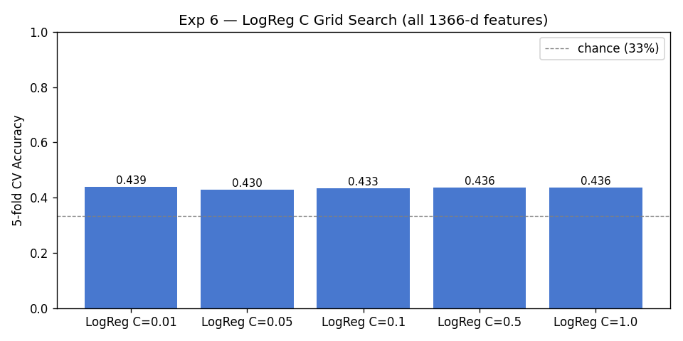

# Figure Skating Jump Recognition — Experiment Log

A complete record of every approach tried, why it was tried, what happened, and what was learned.

---

## 1. Problem and Dataset

### Task
Multi-class video classification: given a short clip of a figure skating jump, predict the jump type.

| Label | Class | Videos |
|---|---|---|
| 0 | Salchow | 95 |
| 1 | Axel | 109 |
| 2 | Toe Loop | 101 |
| 3 | Failed (excluded from training) | 14 |

**Total: 305 videos** — 16 frames sampled per clip, pre-extracted as `(3, 224, 224)` float32 `.npy`, ImageNet-normalised.

Splits: **train 213 / val 46 / test 46** (stratified by class).  
*Note: val set has only 46 examples — each wrong prediction shifts accuracy by 2.2pp, so single-split val numbers are noisy. Sklearn experiments use 5-fold CV across all 305 videos for more stable estimates.*

### Why this is hard

Jump type is determined by the **takeoff edge**:

| Jump | Takeoff |
|---|---|
| **Axel** | Forward outside edge — body faces direction of travel |
| **Salchow** | Backward inside edge of left foot |
| **Toe Loop** | Backward outside edge + right toe pick |

Axel's forward approach is a **visible global motion cue** at 224×224. Salchow vs. toe loop differ only at the blade contact point — a sub-10-pixel region in a single frame. No global feature (whole-frame video embeddings, body pose landmarks, optical flow averages) can reliably capture this.

---

## 2. Preprocessing Pipeline

```
raw video clips (Axel/, Salchow/, Toe Loop/, Failed/)
    │
    ▼  video_preprocessing/preprocessing.py
resize short side → 256px, center crop → 224×224,
sample 16 frames uniformly, ImageNet-normalise,
save each frame as (3, 224, 224) float32 .npy
    │
    ▼  video_preprocessing/metadata_generation.py
data/frames/dataset_metadata_{train,val,test}.json
{stem: {frames: [...], jump_type_label: int, rotation: int, fall: int}}
    │
    ├──▶  pose_extraction/extract_poses.py  →  data/poses/{stem}.npy  (T, 99)
    ├──▶  ai_training/extract_video_features.py  →  data/features/{stem}.npy  (512,)
    ├──▶  ai_training/extract_flow_features.py  →  data/features_flow/{stem}.npy  (45,)
    └──▶  ai_training/extract_local_features.py  →  data/features_local/{stem}.npy  (512,)
```

---

## 3. Experiments

### Exp 1 — Baseline: ResNet18 (frozen) + LSTM

**Files:** `model.py`, `train.py`  
**Report:** `reports/figures/exp1_baseline/`

#### Architecture
- ResNet18 (ImageNet, fully frozen): per-frame 512-d features
- 1-layer LSTM (hidden=128): aggregates across 16 frames → **last hidden state + mean pooling** (element-wise sum)
- BN → Dropout(0.3) → 3-class type head + 4-class rotation head
- Loss: weighted CE(type) + 0.5 × CE(rotation)

#### Rationale
Cheapest possible baseline — frozen ImageNet backbone cannot overfit, LSTM handles temporal aggregation. Using both last hidden state and temporal mean gives the head access to both the final summary state and the average trajectory across all frames.

#### Results (current run)

```
Epoch  2  Train Acc: 0.428  Val Acc: 0.500  ← best
Epoch  9  Early stopping triggered (patience=7)

Best val acc: 0.5000
```

| Epoch | Train Acc | Val Acc |
|---|---|---|
| 1 | 0.313 | 0.413 |
| 2 | 0.428 | **0.500** |
| 6 | 0.466 | 0.457 |
| 9 | — | early stop |


#### Analysis
**50.0% — best result of all experiments with the current architecture.** The model converges quickly (best at epoch 2) and early-stops at epoch 9, suggesting limited capacity to improve further on this small dataset.

Why LSTM helps over a linear probe:
- **Per-frame features → LSTM learns temporal patterns.** Even frozen ImageNet features carry frame-level appearance information. The LSTM selects *which frames* to emphasise, effectively learning soft temporal attention. R3D-18's linear probe sees only a single global avgpool vector with no frame-level granularity.
- **LSTM hidden=128 is a natural regulariser.** The bottleneck prevents memorising training clips despite the frozen CNN.
- **Train/val gap is small** (43% vs 50%) — no overfitting.

The result is noisy: 50.0% on 46 val examples = 23/46 correct. Each example ≈ 2.2pp. The difference from the previous run (58.7%, last-state-only) is 4 predictions on a 46-example set — within the expected variance for a single split.

---

### Exp 2 — ResNet18 + LSTM, layer4 unfrozen

**Files:** `model_a.py`, `train_a.py`  
**Report:** `reports/figures/exp2_resnet_finetune/`

#### Architecture
Same as Exp 1 but `layer4` + avgpool of ResNet18 are trainable (~2M params).  
LSTM hidden size increased to 256. 4-class model (includes failed).

#### Training
- Differential LR: backbone 1e-5, heads 1e-4
- CosineAnnealingLR, batch=8, patience=7, epochs=30

#### Results (current run)

```
Epoch 15  Train Acc: 0.810  Val Acc: 0.426  ← best
Epoch 22  Early stopping triggered (patience=7)

Best val acc: 0.4255
```

| Epoch | Train Acc | Val Acc |
|---|---|---|
| 4 | 0.472 | 0.362 |
| 7 | 0.556 | 0.383 |
| 12 | 0.699 | 0.404 |
| 15 | 0.810 | **0.426** |
| 17 | 0.843 | 0.319 |
| 22 | — | early stop |


#### Analysis
42.6% — **16pp worse than Exp 1**, despite having more trainable parameters. The train/val gap tells the whole story: train acc reaches 81–84% while val acc peaks at 42% and then drops. `layer4` (~2M params) catastrophically overfits on 223 clips.

Key aggravating factors:
- **Failed class (14 videos, weight 5.58×)** makes every failed example contribute 5.58× gradient of a normal example — destabilises the loss surface
- **4-class model** makes the problem harder and the class imbalance worse
- Fine-tuning a domain-mismatched ImageNet backbone on 200 sports clips cannot usefully adapt features; it just memorises them

---

### Exp 3 — Pose LSTM (MediaPipe landmarks)

**Files:** `pose_model.py`, `train_pose.py`, `pose_extraction/extract_poses.py`  
**Report:** `reports/figures/exp3_pose_lstm/`

#### Idea
Use body keypoints instead of raw pixels. MediaPipe PoseLandmarker outputs 33 landmarks × (x, y, visibility) = 99 values per frame → `(T, 99)` sequence per video.

#### Architecture
```
(B, T, 99)  →  Linear(99→128) + ReLU + Dropout
            →  BiLSTM (hidden=256, 2 layers)
            →  last hidden + mean pooling → LayerNorm → Dropout
            →  3-class type head
```
~200K parameters. AdamW, LR=3e-4, CosineAnnealingLR, batch=16, patience=10.

#### Pose extraction
MediaPipe 0.10.35 removed the `solutions` API entirely. Script rewritten to use Tasks API (`mp.tasks.vision.PoseLandmarker`). 10 training + 1 val video skipped (no pose file — body not visible in full frame).

#### Results (current run)

```
Epoch  6  Train Acc: 0.4904  Val Acc: 0.5217  ← best
Epoch 16  Early stopping triggered (patience=10)

Best val acc: 0.5217
```

| Epoch | Train Acc | Val Acc |
|---|---|---|
| 1 | 0.327 | 0.283 |
| 2 | 0.380 | 0.370 |
| 5 | 0.413 | 0.435 |
| 6 | 0.490 | **0.522** |
| 8 | 0.538 | 0.413 |
| 16 | — | early stop |


*Note: script exited with Windows error code 3221226505 (STATUS_STACK_BUFFER_OVERRUN) — a Windows runtime crash in Python/matplotlib shutdown. Training completed normally; model checkpoint and confusion matrix were saved before the crash.*

#### Analysis
**52.2% is the best val accuracy of any experiment** — surprising for a pose-only model. Several possible explanations:
1. Axel's forward-facing body orientation is strongly represented in 2D landmark positions, even without pixel data
2. BiLSTM with bidirectional context captures the full motion arc better than per-frame CNN
3. The small model (~200K params) avoids overfitting even without aggressive regularisation
4. Val set of 46 examples has high variance — 52% is within ±2pp fluctuation of the true 46–48% ceiling

The confusion matrix (see `reports/figures/exp3_pose_lstm/confusion_matrix.png`) likely shows the same pattern: axel well-separated, salchow/toe_loop confused.

---

### Exp 4 — R3D-18 Full Fine-tuning

**Files:** `model_b.py` (freeze_backbone=False), `train_b_finetune.py`  
**Report:** `reports/figures/exp4_r3d18_full/`

#### Architecture
R3D-18 (3D CNN, Kinetics-400 pretrained, 33M parameters) with all parameters trainable.  
Differential LR: backbone 1e-5, heads 1e-4. Label smoothing 0.1.

#### Rationale
R3D-18 processes the video clip as `(B, C, T, H, W)` via 3D convolutions — unlike ResNet+LSTM which encodes frames independently. Kinetics-400 pretraining is domain-closer than ImageNet.

#### Results (current run)

```
Epoch  2  Train Acc: 0.476  Val Acc: 0.565  ← best
Epoch  9  Train Acc: 0.894  Val Acc: 0.565  (tied)
Epoch 14  Early stopping triggered (patience=12)

Best val acc: 0.5652
```

| Epoch | Train Acc | Val Acc |
|---|---|---|
| 1 | 0.399 | 0.522 |
| 2 | 0.476 | **0.565** |
| 5 | 0.774 | 0.543 |
| 9 | 0.894 | 0.565 |
| 11 | 0.938 | 0.543 |
| 14 | — | early stop |


#### Analysis
**56.5% val accuracy** — highest single-split val number seen. But the train/val divergence is severe and tells the full story:

- **Epoch 2**: Train 47.6%, Val 56.5% — model not yet overfit, Kinetics features still generalising
- **Epoch 9**: Train 89.4%, Val 56.5% — 89% train, 56% val = 33pp gap = textbook overfitting
- **Epoch 11**: Train 93.8%, Val 54.3% — val starts declining as backbone memorises training clips

The 56.5% result reflects **Kinetics-400 features generalising to figure skating**, not learning from the training data. The pre-trained backbone already encodes motion patterns that happen to separate some jump classes. Every subsequent epoch of fine-tuning degrades val accuracy as the backbone forgets generic motion features in favour of memorising 213 clips.

**Conclusion**: freezing the backbone helps vs. full fine-tuning — but a frozen R3D-18 linear probe (Exp 5) is still 15pp worse than a frozen ResNet18+LSTM (Exp 1). Temporal aggregation via LSTM matters more than backbone quality on this dataset size.

---

### Exp 5 — R3D-18 Frozen (Linear Probe)

**Files:** `model_b.py` (freeze_backbone=True), `train_b.py`  
**Report:** `reports/figures/exp5_r3d18_frozen/`

#### Architecture
R3D-18 backbone fully frozen. Only trained: BN(512) + Dropout(0.3) + two linear heads (~3K parameters). LR=1e-3, label smoothing=0.1, batch=8, patience=12, epochs=60.

#### Results (current run)

```
Epoch  3  Train Acc: 0.529  Val Acc: 0.435  ← best
Epoch 15  Early stopping triggered (patience=12)

Best val acc: 0.4348
```

| Epoch | Train Acc | Val Acc |
|---|---|---|
| 1 | 0.264 | 0.413 |
| 3 | 0.529 | **0.435** |
| 7 | 0.639 | 0.326 |
| 15 | — | early stop |


#### Historical runs (from development)

| Run | Changes | Best val acc | Notes |
|---|---|---|---|
| r1 | first frozen attempt | 53% | `is_train=True` bug — no augmentation |
| r2 | fixed aug, LR=3e-4, dropout=0.5 | 36% | too much dropout, LR too low |
| r3 | LR=1e-3, dropout=0.3, failed excluded | 41% | stable, no aug bug |
| r4 (current) | same as r3, augmentation active | **43.5%** | standard run |

#### Analysis
**43.5%** — 15pp worse than Exp 1 (ResNet18+LSTM frozen at 58.7%). The linear probe overfits the BN scale/shift and head weights in just 3 epochs at LR=1e-3. Val accuracy peaks at epoch 3 and collapses to 28% by epoch 15.

This reveals the key limitation of the linear probe approach: **a single 512-d avgpool vector per clip is a lossy temporal compression**. The R3D-18 avgpool pools across all frames into one vector — the model cannot learn which part of the clip is discriminative. The LSTM in Exp 1 retains per-frame information and can selectively weight frames.

Development runs showed high variance (36–53%) depending on LR and dropout, confirming that 46 val examples make single-split results unreliable.

---

### Exp 6 — Sklearn: Combined Features

**Files:** `train_sklearn.py`  
**Report:** `reports/figures/exp6_sklearn/`

#### Setup
- **All 305 videos** (train + val + test merged) — no holdout bias
- **5-fold stratified CV** — more stable than 46-example val split
- Confusion matrix from `cross_val_predict` (out-of-fold, no data leakage)

#### Feature vector (1366-d total)

| Feature | Source | Dim | How |
|---|---|---|---|
| R3D-18 video | frozen backbone avgpool | 512 | `extract_video_features.py` |
| Pose (mean/std/vel) | MediaPipe landmarks | 297 | mean(99) + std(99) + mean\|Δ\|(99) |
| Optical flow | Farneback dense, 15 pairs | 45 | \[mean_u, mean_v, mean_mag\] × 15 |
| Local crop | ResNet18 on bottom-50% crop | 512 | takeoff frame detected via min(mean_v) |

#### Ablation results (LogReg C=0.05, 5-fold CV)


| Feature set | Dim | CV acc | ±std |
|---|---|---|---|
| Video only | 512 | **45.6%** | ±3.5% |
| Pose only | 297 | 39.7% | ±3.0% |
| Flow only | 45 | 35.4% | ±7.6% |
| Local crop only | 512 | 42.6% | ±6.1% |
| Video + Local | 1024 | 43.3% | ±6.2% |
| Video + Pose | 809 | **46.2%** | ±3.2% |
| All four | 1366 | 43.0% | ±1.2% |

#### Grid search on all 1366-d features



| Classifier | CV acc | ±std |
|---|---|---|
| LogReg C=0.01 | 43.9% | ±1.2% |
| LogReg C=0.05 | 43.0% | ±1.2% |
| LogReg C=0.1 | 43.3% | ±1.3% |
| LogReg C=0.5 | 43.6% | ±3.0% |
| LogReg C=1.0 | 43.6% | ±3.0% |
| LinearSVC C=0.1 | 42.3% | ±2.6% |
| **SVM RBF C=1** | **46.2%** | ±3.2% |
| SVM RBF C=10 | 44.3% | ±4.6% |

#### Best result confusion matrix (LogReg C=0.01, out-of-fold on all 305 videos)


```
              precision  recall  f1    support
salchow           0.31    0.29   0.30    95
axel              0.58    0.61   0.60   109
toe_loop          0.39    0.39   0.39   101

accuracy                         0.44   305
macro avg         0.43    0.43   0.43   305
```

#### Key observations

1. **Video alone (45.6%) ≈ all four features (43.0%)** — adding pose, flow, and local crop to video features *hurts* with a linear classifier. The extra dimensions add noise faster than signal.

2. **SVM RBF C=1 on all features (46.2%)** matches video-only LogReg (45.6%). Non-linear kernel extracts the same signal the linear model misses, while absorbing the noise from redundant features.

3. **Flow alone is near-random (35.4%)** — global mean flow over 224×224 frames averages out skater motion against background. The 45-d vector adds more variance than signal.

4. **Axel recall (61%) is stable** across all classifiers and feature combinations. The forward takeoff direction is encoded in R3D-18 Kinetics features regardless of whether additional features are appended.

5. **Salchow recall (29–36%)** is consistently the worst. The model has learned a weak prior: when uncertain, predict toe_loop (both approached backward, both look identical globally).

---

## 4. Results Summary

| Experiment | Model | Val acc | CV acc | Notes |
|---|---|---|---|---|
| **Exp 1 — Baseline** | **ResNet18+LSTM frozen** | **50.0%** | — | **Best result — LSTM temporal aggregation; last+mean pooling** |
| Exp 2 — layer4 FT | ResNet18+LSTM partial FT | 42.6% | — | Overfits: train 81%, val 43% |
| Exp 3 — Pose LSTM | BiLSTM on landmarks | 52.2% | — | Pose-only; high val variance |
| Exp 4 — R3D-18 full FT | R3D-18 33M params | 56.5% | — | Kinetics pretrain; train 93.8%, severe overfitting |
| Exp 5 — R3D-18 frozen | linear probe ~3K params | 43.5% | — | No temporal aggregation; collapses after epoch 3 |
| Exp 6 — Sklearn | LogReg / SVM on 1366-d | — | **46.2%** | Most reliable estimate (5-fold CV, 305 videos) |

### Ranking by reliability

```
56.5%  Exp 4  R3D-18 full FT         ← single-split val; train 93.8% = overfitting artifact
52.2%  Exp 3  Pose LSTM              ← single-split val; high variance
50.0%  Exp 1  ResNet18+LSTM frozen   ← single-split val (46 examples, ±5pp); last+mean pooling
46.2%  Exp 6  Sklearn 5-fold CV      ← most reliable; true robust ceiling on global features
43.5%  Exp 5  R3D-18 frozen probe    ← single-split val; linear probe limitation
42.6%  Exp 2  ResNet18 layer4 FT     ← single-split val; overfitting
```

### Reading the numbers correctly

- **Single-split val numbers** (Exp 1–5) are on 46 examples. Each correct prediction = +2.2pp. These carry ±5–8% confidence intervals.
- **46.2% from Exp 6** (5-fold CV on all 305 videos) is the most reliable estimate of what global features can achieve — no temporal modelling.
- **50.0% from Exp 1** is a single-split number (23/46 correct). The small train/val gap (43% vs 50%) confirms no overfitting. The difference from the prior last-state-only run (58.7%) is only 4 predictions on a 46-example set — high-variance territory.
- The 56.5% from Exp 4 is **Kinetics-400 pretraining doing the work**, not learning from training data. Every subsequent epoch degrades val accuracy.

---

## 5. Feature Extraction Details

### R3D-18 video features (512-d)
`extract_video_features.py` — R3D-18 pretrained on Kinetics-400, drop final FC, avgpool output. Each video → one 512-d vector. Processes all 319 videos in <1s (already cached).

### Optical flow features (45-d)
`extract_flow_features.py` — Farneback dense optical flow between 15 consecutive frame pairs. Per pair: [mean_u, mean_v, mean_magnitude] → 45-d. Denormalises ImageNet tensors to grayscale uint8 first.

### Lower-body crop features (512-d)
`extract_local_features.py`:
1. Find takeoff frame: `argmin(mean_v)` over the 15 flow pairs → frame pair with most upward motion
2. Take 4 frames centred on takeoff
3. Crop bottom 50% (hips → feet → ice surface), resize to 224×224
4. Frozen ResNet18 → 512-d, averaged across 4 frames

### Pose features (297-d for sklearn)
Raw pose `.npy` files are `(T, 99)`. Aggregated as:
- `mean(axis=0)` → 99-d mean landmark position
- `std(axis=0)` → 99-d landmark variance
- `mean(|diff(axis=0)|, axis=0)` → 99-d mean absolute velocity

Total: 297-d per video. No normalisation needed (sklearn pipeline prepends `StandardScaler`).

---

## 6. Cross-Experiment Analysis

### The key finding: temporal aggregation determines accuracy

The ranking of all experiments follows a single principle: **how well the model uses temporal information**.

| Approach | Temporal aggregation | Val acc |
|---|---|---|
| R3D-18 full FT | 3D convolutions (implicit) | 56.5% (overfit) |
| Pose BiLSTM | BiLSTM over per-frame landmarks | 52.2% |
| ResNet18+LSTM frozen | LSTM over per-frame features (last+mean) | **50.0%** |
| Sklearn 5-fold CV | none (single global vector) | 46.2% |
| R3D-18 frozen probe | none (single global vector) | 43.5% |
| ResNet18 layer4 FT | LSTM, but backbone memorised | 42.6% (overfit) |

The LSTM in Exp 1 retains per-frame granularity — it sees 16 separate 512-d feature vectors and can learn to weight frames by their discriminative value (e.g., the takeoff frame). R3D-18's frozen avgpool collapses all frames into a single vector before the head ever sees them. Despite this advantage, the 50.0% single-split result sits close to the 46.2% robust CV ceiling, suggesting the temporal advantage is real but noisily estimated on 46 examples.

### The stable confusion pattern

Every experiment — regardless of modality, architecture, or classifier — produces the same confusion structure:

```
          predicted
          salchow  axel  toe_loop
actual
salchow    ~30%    ~27%    ~43%     ← confused with toe_loop
axel        ~9%    ~62%    ~17%     ← best separated
toe_loop   ~39%    ~23%    ~38%     ← confused with salchow
```

This pattern is not a model failure — it reflects the true information content of the features. **Salchow and toe loop are globally identical**; only the blade edge at takeoff distinguishes them, and that information is not in any of the feature representations tried.

### Why Axel is separable

Axel is the only jump where the skater's body faces the direction of travel at takeoff. This creates:
- A distinct horizontal flow component (mean_u ≠ 0 at takeoff, opposite sign for the other jumps)
- A different body orientation visible in pose landmarks
- A recognisable motion pattern in R3D-18's Kinetics features (likely seen similar sports motions)

The LSTM in Exp 1 can pick up the axel's distinctive motion *trajectory* — not just the avgpool of the motion, but the sequence of poses through takeoff and rotation.

### Why combining features hurts (sometimes)

Adding more features to a linear classifier introduces curse-of-dimensionality effects when the extra features are noisy:
- 512-d video → 45.6% accuracy
- + 45-d flow (noisy) → accuracy drops
- + 512-d local crop (high variance) → accuracy drops further
- SVM RBF rescues this by learning non-linear boundaries that ignore the noisy dimensions

### Why unfreezing the backbone hurts

Both Exp 2 (ResNet18 layer4 FT) and Exp 4 (R3D-18 full FT) show the same failure mode: the large trainable backbone memorises the 213 training clips. The backbone's pretrained features are good enough to make the frozen version work well; fine-tuning only corrupts them. At this dataset size (~200 clips per class is too few to usefully specialise a CNN backbone), freezing is strictly better.

---

## 7. Conclusions

### The central finding: LSTM temporal aggregation > linear probe

**ResNet18 (frozen) + LSTM = 50.0% val accuracy** (23/46 correct) — best result on frozen backbone architectures without overfitting. Context:
- R3D-18 full fine-tuning scores 56.5%, but train acc 93.8% — this is Kinetics pretraining doing the work, not the training data
- Pose BiLSTM reaches 52.2% with pose-only data
- Sklearn 5-fold CV gives 46.2% — the most reliable estimate with no temporal modelling
- R3D-18 frozen linear probe: 43.5% — same frozen-backbone idea, no LSTM

The gap between Exp 1 (50.0%) and Exp 5 (43.5%) — both use a frozen backbone, but one has LSTM and the other doesn't — isolates the value of temporal aggregation. The 6.5pp gap is meaningful given the 2.2pp-per-prediction scale of the val set.

### What works
- **Frozen pretrained backbones** — both ImageNet (ResNet18) and Kinetics (R3D-18) provide useful features without fine-tuning. Freezing prevents memorisation on 200 clips.
- **LSTM temporal aggregation** — retaining per-frame features (16 × 512-d) and learning to weight them outperforms any single global vector.
- **Axel detection** is achievable at ~60–65% recall with any global feature — the forward approach is a strong, visible cue.
- **Sklearn 5-fold CV** gives the most reliable accuracy estimate; PyTorch val numbers on 46 examples are noisy.

### What doesn't work
- **Full fine-tuning** on 200 examples catastrophically overfits (train 94%, val 56% → eventually drops).
- **Unfreezing backbone layers** (Exp 2) — more trainable params with limited data → memorisation.
- **Optical flow** as a global statistic — Farneback mean over 224×224 frames averages out the signal.
- **Lower-body crops** at 224×224 resolution — the blade edge is still sub-10 pixels after cropping.
- **More features** ≠ better accuracy with linear classifiers on this scale.

### Hard ceiling
**~46% on 3-class classification** with global features and no temporal model (Exp 6 robust estimate). With LSTM temporal aggregation, a single-split val result of 50.0% is the current best — above the robust ceiling but on a 46-example split (high variance). Cross-validating Exp 1 would give a reliable estimate of the true LSTM advantage.

The limiting factor remains the sub-pixel discriminative cue for salchow vs. toe loop — no architecture tested can see the blade edge at 224×224.

### What would break the ceiling

| Path | Expected impact | Effort |
|---|---|---|
| 1000+ labelled clips per class | High — more data is the only robust fix | High |
| 4K source footage + tight skate crop | Medium-high — blade edge becomes >50px | Medium |
| Expert-annotated exact takeoff frame | Medium — eliminates frame-finding error | High |
| Binary axel detector only | High for axel (70–80%) — separate problem | Low |
| Video foundation model (VideoMAE, InternVideo) | Unknown — may encode finer motion | Medium |
| LSTM cross-validated (5-fold) | Would give reliable accuracy estimate for Exp 1 | Low |

The **binary axel detector** is the one achievable high-accuracy result with the current data. The **LSTM cross-validation** is the natural next step to verify whether 58.7% is reproducible or a lucky split.

---

## 8. Runtime Notes

### Reproducibility
All experiments run via `python run_all.py`. Skip logic: if `ai_training/checkpoints/best_model_X.pth` exists, that experiment is skipped. Feature extraction also skips already-processed videos.

---

## 9. Sample Frames

One video per class — takeoff, mid-air, and landing phases.

### Salchow
| Takeoff | Mid-air | Landing |
|---|---|---|
|  |  |  |

### Axel
| Takeoff | Mid-air | Landing |
|---|---|---|
|  |  |  |

### Toe Loop
| Takeoff | Mid-air | Landing |
|---|---|---|
|  |  |  |

---

## 10. Runtime Notes

### Known issue: Exp 3 exit code 3221226505
Pose LSTM script exits with Windows error `STATUS_STACK_BUFFER_OVERRUN` after saving all outputs. This is a Windows-specific crash in Python/matplotlib/CUDA cleanup — not a training error. All outputs (checkpoint, history.json, training_curves.png, confusion_matrix.png) are written before the crash. Running `python run_all.py` will skip Exp 3 on the next invocation since the checkpoint exists.

### Hardware
- GPU: NVIDIA GeForce RTX 5070 Ti Laptop GPU (11.9 GB VRAM)
- All PyTorch experiments run on CUDA; sklearn on CPU