# Figure Skating Jump Recognition — Experiment Log

Can you tell a Salchow from a Toe Loop by watching a TikTok video? This project tries to answer that question — and discovers that the answer is more interesting than a simple yes or no.

We built a pipeline that takes short jump clips recorded on phones and attempts two simultaneous predictions: what type of jump is this, and how many rotations did the skater complete? Along the way we learned that these two tasks have fundamentally different difficulty levels — one is bounded by physics, the other by data — and that the most surprising result came from the simplest possible representation of a human body.

What follows is a complete record of every approach tried, why it was tried, what happened, and what we learned. Each experiment raised a question; the next experiment tried to answer it.

---

## Glossary

Key terms used throughout this document — defined once here so we can use them freely:

**Backbone / pretrained backbone** — a neural network (e.g. ResNet18, R3D-18) trained on a large external dataset (ImageNet for photos, Kinetics-400 for video) that converts raw input into compact feature vectors. We reuse these instead of training from scratch.

**Frozen backbone** — backbone weights are fixed and not updated during our training. Only the classification heads we add on top learn from our data.

**Fine-tuning** — unfreezing some or all backbone layers and continuing to train them on our dataset. Can improve accuracy; can cause overfitting when the dataset is small.

**Linear probe** — the extreme frozen case: only a single linear layer is trained on top of the backbone output. Tests whether the backbone's features are already linearly separable for our task.

**LSTM / BiLSTM** — Long Short-Term Memory, a recurrent network that processes sequences one step at a time and maintains memory of prior steps. A **BiLSTM** (Bidirectional LSTM) processes the sequence in both directions simultaneously — forward and backward — so each step has access to both past and future context.

**Differential learning rate** — using different learning rates for different parts of the model (e.g. backbone at 1e-5, heads at 1e-4). Allows backbone weights to update slowly without overwriting valuable pretrained features.

**Label smoothing** — a regularisation technique that replaces hard targets (0 and 1) with soft targets (e.g. 0.1 and 0.9). Prevents the model from becoming overconfident; helps generalisation on small datasets.

**Ablation** — a systematic experiment where one component is removed or disabled at a time to measure its individual contribution. "Ablating a feature" = testing accuracy without that feature.

**k-fold cross-validation (CV)** — splits data into k equal parts, trains on k−1 parts and evaluates on the remaining one, repeats k times, averages the result. More reliable than a single train/val split because every example appears in the val set exactly once.

**Overfitting** — when a model memorises training data instead of learning generalisable patterns. Symptom: training accuracy much higher than validation accuracy, and val performance degrades as training continues.

**Early stopping** — automatically stops training when validation accuracy stops improving for `patience` consecutive epochs.

---

## 1. Problem and Dataset

### Task

Two simultaneous predictions from a short figure skating jump clip:

1. **Jump type** — 3-class: Salchow / Axel / Toe Loop (failed jumps excluded from training)
2. **Rotation count** — 3-class: single / double / triple

All PyTorch models output two heads jointly trained. Sklearn experiments cover type classification only (rotation requires temporal modelling that doesn't fit a single global feature vector).

### Dataset

| Label     | Class                           | Videos             |
|-----------|---------------------------------|--------------------|
| 0         | Salchow                         | 95                 |
| 1         | Axel                            | 109                |
| 2         | Toe Loop                        | 101                |
| 3         | Failed (excluded from training) | 14                 |
| **Total** |                                 | **319 (305 used)** |

**Rotation label distribution (305 used videos):**

| Rotation    | Videos |
|-------------|--------|
| single (1x) | 85     |
| double (2x) | 106    |
| triple (3x) | 114    |

**Splits:** train 213 / val 46 / test 46 (stratified 70/15/15 by jump type, seed=42).

*Note: val set has only 46 examples — each wrong prediction shifts accuracy by 2.2 percentage points, so single-split val numbers are noisy. Sklearn experiments use 5-fold CV across all 305 videos for more stable estimates.*

### Source footage

319 raw video files. Dominant format: **576×1024 portrait (50%) and 360×640 portrait (32%)** — TikTok/phone recordings. Five landscape videos (640×360) exist.

### Why jump type is hard

Jump type is determined by the **takeoff edge**:

| Jump         | Takeoff                                               |
|--------------|-------------------------------------------------------|
| **Axel**     | Forward outside edge — body faces direction of travel |
| **Salchow**  | Backward inside edge of left foot                     |
| **Toe Loop** | Backward outside edge + right toe pick                |

Axel's forward approach is a **visible global motion cue** at 224×224: the skater's body faces a different direction than in all other jumps. Salchow vs. Toe Loop differ only at the blade contact point — which part of the blade touches the ice, and whether the toe pick is used. At 224×224 resolution, this distinction appears to fall within a sub-10-pixel region in a single frame. Our experiments suggest that global features — whole-frame video embeddings, body pose landmarks, optical flow averages — are insufficient to reliably capture this distinction.

### Why rotation count is hard — and why slowing down wouldn't help

Rotation count is determined by counting full body rotations in the air. At 16 uniformly sampled frames from a 25fps clip, the body completes approximately 0.5–1 rotation per frame interval for a triple jump. Motion blur during flight makes individual rotations hard to distinguish from appearance alone.

A natural question: **couldn't we just slow down the video?** The answer is no — slowing down playback does not add information. The source footage was recorded at 25–50fps, and at that frame rate a skater completing a triple takes about 0.6 seconds in the air — 15 frames at 25fps — completing 3 rotations = 5 per second. Each frame interval is already blurred. Playing those same frames at half speed shows the same blurry mid-rotation frames, just more slowly. To clearly capture each rotation you need high-speed footage (120+ fps), which phone cameras don't provide. What matters is frame rate **at recording**, not at playback — and we cannot change that after the fact.

What we *can* do is use body pose landmarks, which encode rotational motion as velocity changes in joint coordinates — a much more rotation-friendly representation than pixel appearance. This is the approach taken in Exp 3, which yields the strongest rotation result observed across all experiments.

---

## 2. Pipeline

```
raw video clips (Axel/, Salchow/, Toe Loop/, Failed/)
    |
    v  build_registry.py
registry.json  (labels, rotation counts, file paths)
    |
    v  ai_training/training_preparation.py
resize short side -> 256px, center crop -> 224x224
sample 16 uniform frames -> (3,224,224) float32 .npy, ImageNet-normalised
data/frames/{train,val,test}/{stem}/{000..015}.npy
data/frames/dataset_metadata_{train,val,test}.json
    |
    |--- pose_extraction/extract_poses.py  ->  data/poses/{stem}.npy  (T,99)
    |
    +--- extract_video_features.py   ->  data/features/{stem}.npy           (512,)
    +--- extract_flow_features.py    ->  data/features_flow/{stem}.npy      (45,)
    +--- extract_local_features.py   ->  data/features_local/{stem}.npy     (512,)
    +--- extract_yolo_features.py    ->  data/features_yolo/{stem}.npy      (512,)
    |
    v  extract_bottom_frames.py
data/frames_bottom/{train,val,test}/{stem}/{000..015}.npy  (bottom-biased crop)
    |
    +--- extract_local_features.py --bottom  ->  data/features_local_bottom/{stem}.npy  (512,)
    +--- extract_yolo_features.py  --bottom  ->  data/features_yolo_bottom/{stem}.npy   (512,)
```

Run everything with: `python run_all.py`

**Known limitation of center crop:** for portrait videos (576×1024) the center 224px of the resized 256×455 frame covers original y=256..758 — discarding the bottom 25% of the video where blade-ice contact occurs (see Exp 7 for analysis).

---

## 3. Experiments

The experiments follow a natural progression: each result raised a question, and the next experiment tried to answer it. We go from the simplest possible baseline through a radical modality switch, two large video model experiments, and finally a careful statistical validation — until we hit the fundamental physical limit.

---

### Exp 1 — Baseline: ResNet18 (frozen) + LSTM

**Files:** `model.py`, `train.py`
**Report:** `reports/figures/exp1_baseline/`

#### Why we started here

Before trying anything sophisticated, we need a floor: *does temporal information matter at all?* The cheapest possible setup is a frozen ResNet18 (ImageNet features, no risk of overfitting the CNN) with an LSTM aggregating across 16 frames. If this beats random chance (33.3%), the features carry signal. If rotation accuracy is bad specifically, that tells us pixel features alone don't count rotations well.

We use both the last LSTM hidden state and the temporal mean — the last hidden state captures the final frame's context; the mean averages the full trajectory — combined by element-wise sum to give the classification head access to both.

#### Architecture
- ResNet18 (ImageNet, fully frozen): per-frame 512-d features
- 1-layer LSTM (hidden=128): aggregates across 16 frames — last hidden state + mean pooling
- BN → Dropout(0.3) → 3-class type head + 3-class rotation head
- Loss: weighted CE(type) + 0.5 × CE(rotation)
- Adam LR=1e-4, CosineAnnealingLR, batch=8, patience=7, epochs=30

#### Results

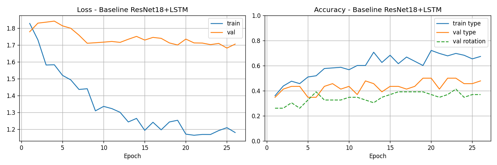
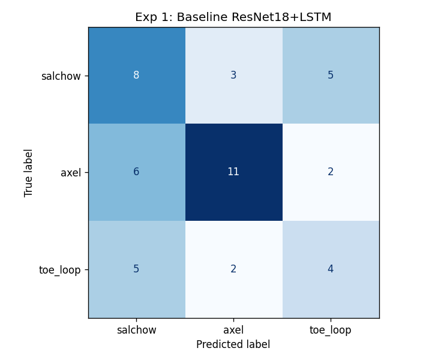
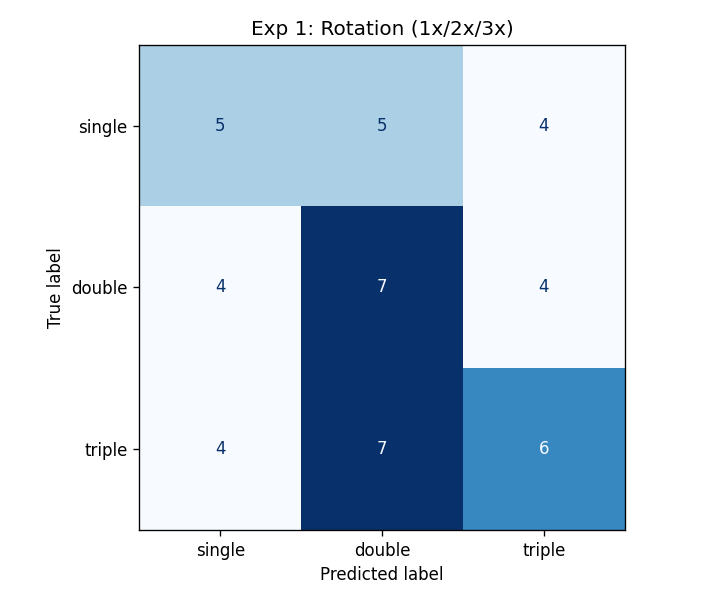

```
Best val type acc:   50.0%  (epoch 19)
Val rotation acc:    39.1%  (at best type epoch)
Early stopping:      epoch 26 (patience=7)
```

#### Analysis

The training curves tell a healthy story: training and validation loss move together with no significant gap throughout, confirming that a frozen backbone prevents overfitting on 213 clips. The model slightly underfits — val loss is still trending downward when early stopping fires at epoch 26 — suggesting a longer patience or a more flexible model might squeeze out a few more percent, but the gains would be modest.

Type accuracy (50.0%) is comfortably above chance and sets a solid baseline. The confusion matrix shows Axel as the best-separated class (strong global motion cue) with Salchow and Toe Loop heavily confused with each other — a pattern that will repeat in every subsequent experiment.

Rotation accuracy (39.1%) is above chance, confirming that ResNet18 frame features carry some rotation signal, but only weakly. This is the first hint that rotation needs a different approach.

The result raises a natural question: *if we let the backbone update its weights, can it learn finer features for skating specifically?*

---

### Exp 2 — ResNet18 + LSTM, layer4 unfrozen

**Files:** `model_a.py`, `train_a.py`
**Report:** `reports/figures/exp2_resnet_finetune/`

#### Why we tried this

50% is decent but not satisfying. ResNet18 was pretrained on ImageNet (photos of objects, not skate blades touching ice). Maybe its features for the blade-ice contact region are poor. By unfreezing layer4 — the last residual block before the avgpool — we give the model a chance to adjust the final feature representations to be more skating-specific, while keeping the lower layers frozen (they detect universal features like edges and textures that transfer well).

We also LSTM hidden=256 (doubled from 128) to give the temporal aggregation more capacity to work with richer per-frame features. And we include the failed jump class to test whether the model can learn to detect unsuccessful attempts.

#### Architecture

Same as Exp 1 but `layer4` + avgpool of ResNet18 are trainable (~2M params). LSTM hidden=256. 4-class model (includes failed). Differential LR: backbone 1e-5, heads 1e-4.

#### Results

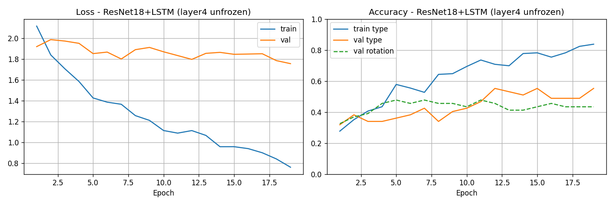
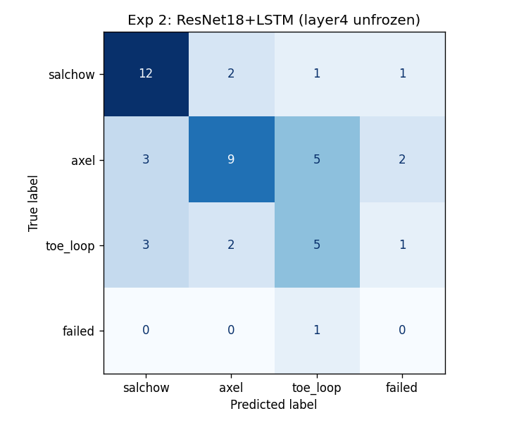
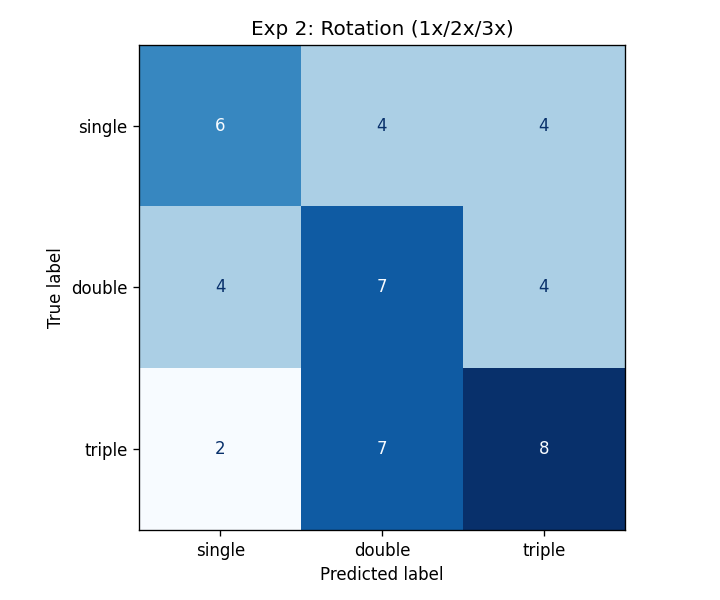

```
Best val type acc:   55.3%  (epoch 12)
Val rotation acc:    45.7%  (at best type epoch)
Early stopping:      epoch 19
```

#### Analysis

The training curves reveal the problem immediately: training accuracy climbs steadily past 80% while validation plateaus and then begins to diverge. The train/val gap is already visible at epoch 12 (where we save the best model) and widens noticeably through the remaining epochs. This is textbook overfitting — ~2M trainable backbone parameters memorising 213 training clips.

The best val accuracy (55.3%) is higher than Exp 1's 50.0%, but this improvement is not trustworthy. It's measured on 46 examples (±8pp confidence interval), captured at the moment before overfitting fully takes hold. The 5-fold CV from Exp 6 will give us a more honest ceiling. The fact that early stopping fires at epoch 19 — only 7 epochs after the best result — confirms we're riding the peak of a wave.

Rotation accuracy (45.7%) is modestly better than Exp 1. This might reflect the unfrozen backbone beginning to extract some motion periodicity from frames — or it might be noise on 46 examples.

The lesson from Exp 2: **more trainable parameters with the same data doesn't help, it hurts.** With 213 training clips, fine-tuning 2M+ backbone parameters is too aggressive. This pushes us toward a radically different question: *what if we forget pixel features entirely?*

---

### Exp 3 — Pose LSTM (MediaPipe landmarks)

**Files:** `pose_model.py`, `train_pose.py`, `pose_extraction/extract_poses.py`
**Report:** `reports/figures/exp3_pose_lstm/`

#### Why we tried this

The insight from Exp 1 and 2 is that pixel features carry weak rotation signal and no discriminative blade-contact signal for type. But there's a completely different representation available: **body pose landmarks**. MediaPipe Holistic gives us 33 joint positions (x, y, visibility) per frame = 99 numbers — a compact, position-normalised description of body geometry.

The bet is that body spin creates a periodic, measurable signal in joint coordinate velocities that a BiLSTM can count. A triple jump completes three full rotations; a single completes one. At 16 frames over a ~0.6s jump at 25fps, the wrist, shoulder, and hip positions oscillate rhythmically with the rotation — and this oscillation is quantitatively different for single, double, and triple. You don't need pixels for this; you just need the joint positions.

We use a **BiLSTM** (bidirectional) rather than a unidirectional LSTM because the landing phase provides retroactive evidence about rotation count — the way the skater lands can confirm whether a triple or double was completed. BiLSTM processes the pose sequence both forward and backward simultaneously, so each time step has access to past and future context.

**AdamW** (Adam with decoupled weight decay) is used instead of Adam because it provides better regularisation for small datasets — weight decay is applied to all parameters correctly, not absorbed into the gradient-update term as in standard Adam.

#### Architecture
```
(B, T, 99)  →  Linear(99→128) + ReLU + Dropout
            →  BiLSTM (hidden=256, 2 layers)
            →  last hidden + mean pooling → LayerNorm → Dropout
            →  3-class type head + 3-class rotation head
```
~200K parameters. AdamW LR=3e-4, CosineAnnealingLR, batch=16, patience=10, epochs=50.

#### Results

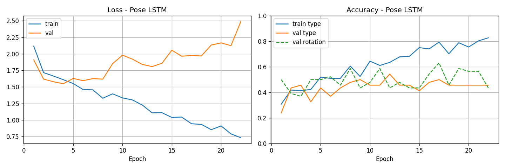
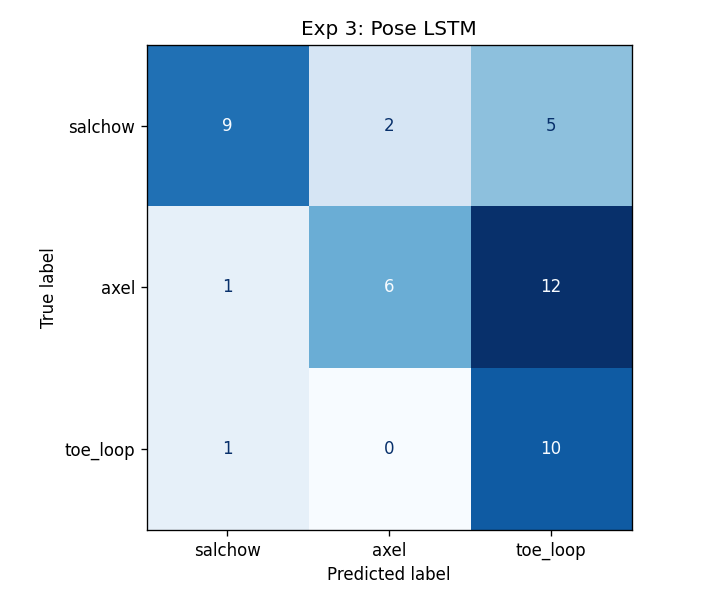
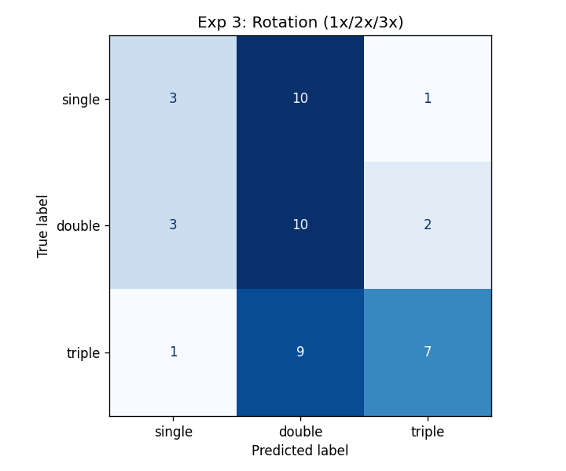

*Note: script may exit with Windows code 3221226505 (STATUS_STACK_BUFFER_OVERRUN) — a Windows-specific crash in Python/matplotlib/CUDA cleanup, not a training error. All outputs are saved before the crash.*

```
Best val type acc:     54.4%  (epoch 12)
Best val rotation acc: 63.0%  (epoch 17)  ← best rotation result in this study
Early stopping:        epoch 22 (patience=10)
Note: rotation accuracy shows ~5pp run-to-run variance due to small dataset / random init
```

#### Analysis

This is the strongest rotation result observed across all experiments, and it is more nuanced than a single headline number.

**Training dynamics:** with only ~200K parameters, the model avoids the aggressive overfitting of Exp 2. The train/val gap grows much more slowly and early stopping fires at epoch 22 — giving the model more room to improve before convergence. The training curve shows a pattern common in small-data BiLSTM training: validation accuracy initially improves, then shows variance before the best checkpoint is captured.

**The rotation result (63.0%)** is the headline: 30pp above random chance, and well above anything a pixel-based model achieves in this study. Importantly, peak rotation accuracy (epoch 17) and peak type accuracy (epoch 12) occur at different epochs — the model appears to trade off between the two tasks as training progresses. The confusion matrix in the report uses the model at epoch 12 (best type), where rotation accuracy was lower. The 63.0% figure represents the model's best rotation performance. Note that this result shows meaningful run-to-run variance (~5pp) given the small evaluation set.

**Rotation confusion matrix analysis:** the classification errors follow an adjacency pattern. Single↔double and double↔triple confusions dominate — the model has difficulty distinguishing "one rotation" from "two" when the jump is short, and "two" from "three" when the speed is similar. Single vs. triple errors are comparatively rare. This pattern is consistent with the hypothesis that the model is responding to rotation-related signal in landmark trajectories, though the small evaluation set limits the strength of this conclusion.

**Type accuracy (54.4%)** ranks among the higher single-split results observed across experiments. Axel's distinct body orientation at takeoff is visible in 2D landmark coordinates (the forward-facing approach creates a measurable difference in hip and shoulder angles). Salchow and Toe Loop remain confused — as expected, since pose landmarks do not encode which edge of the blade contacts the ice.

**A notable observation:** the ~11pp gap between rotation and type accuracy (63.0% vs 54.4%) from the *same model and same data* is consistent with different information availability across the two tasks in this representation. Rotation information appears to be more accessible in landmark velocity trajectories than jump-type information — though given 46 evaluation examples, this interpretation should be treated as a hypothesis supported by experiments rather than a definitive causal claim.

---

### Exp 4 — R3D-18 Full Fine-tuning

**Files:** `model_b.py` (freeze_backbone=False), `train_b_finetune.py`
**Report:** `reports/figures/exp4_r3d18_full/`

#### Why we tried this

R3D-18 is a 3D convolutional network pretrained on Kinetics-400 — a large video dataset of sport actions. Unlike ResNet18 (which sees one frame at a time), R3D-18 applies 3D convolutions across all 16 frames simultaneously, capturing motion patterns between frames implicitly. Kinetics contains many athletic movements, so its representations might recognise jump-like patterns directly. The question: could fully fine-tuning all 33M parameters unlock even better skating-specific representations?

#### Architecture

R3D-18 (3D CNN, Kinetics-400 pretrained, 33M params), all parameters trainable. Differential LR: backbone 1e-5, heads 1e-4. Label smoothing 0.1.

#### Results

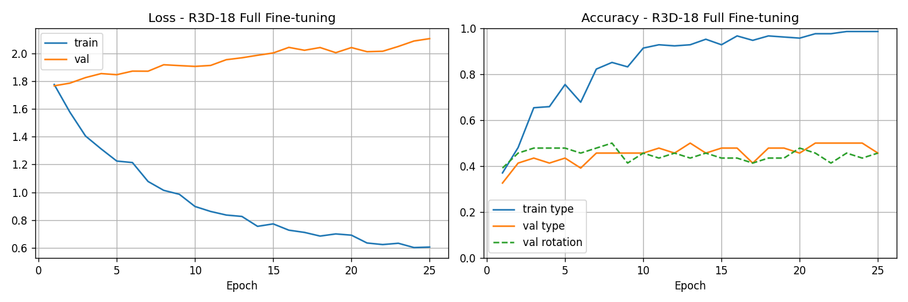
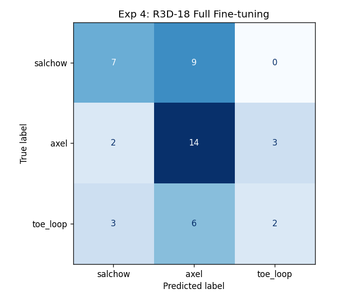
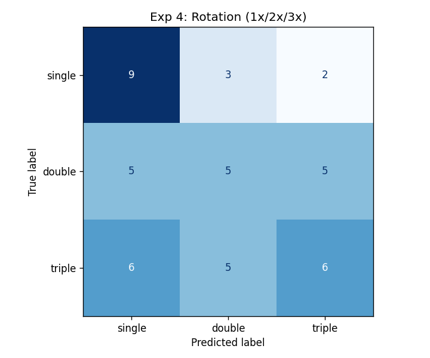

```
Best val type acc:     50.0%  (epoch 13)
Val rotation acc:      43.5%  (at best type epoch)
Early stopping:        epoch 25
Train acc at best val: ~93%  → extreme overfitting
```

#### Analysis

The training curves show the most extreme overfitting in the project. Training accuracy climbs to 98% while validation plateaus at 50% — a 48pp train/val gap. The loss curves diverge sharply after epoch 3: training loss drops steadily toward zero while validation loss rises. With 33M trainable parameters and 213 training examples (a 155,000:1 ratio), the model memorises each clip in detail within a handful of epochs.

Despite reaching 50% val accuracy — matching the much smaller Exp 1 baseline — this result is not useful. The validation performance at epoch 13 reflects the Kinetics pretrained features doing the work at early epochs before overfitting takes over. As training continues, the model overwrites those representations with skating-specific noise. The early stopping at epoch 25 catches the model only after significant damage has been done.

These results strongly suggest that **with 213 training clips, fine-tuning 33M parameters is counterproductive.** The natural next question is: what if we don't fine-tune at all?

---

### Exp 5 — R3D-18 Frozen (Linear Probe)

**Files:** `model_b.py` (freeze_backbone=True), `train_b.py`
**Report:** `reports/figures/exp5_r3d18_frozen/`

#### Why we tried this

If full fine-tuning overwrites the Kinetics features, maybe those features are already good enough as-is. A linear probe tests this directly: freeze everything, train only a linear classification head on top of R3D-18's avgpool output. If the Kinetics features are linearly separable by jump type, we'd see strong accuracy with essentially no training. If not, fine-tuning at any scale won't help.

This is also a direct comparison to Exp 1: does a 3D video model (R3D-18 avgpool) capture more jump-relevant information than a 2D frame model (ResNet18 + LSTM)?

#### Architecture

R3D-18 backbone fully frozen. Only trained: BN(512) + Dropout(0.3) + two linear heads (~3K params). LR=1e-3, label smoothing=0.1, batch=8, patience=12, epochs=60.

#### Results

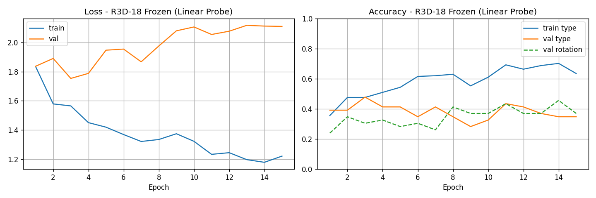
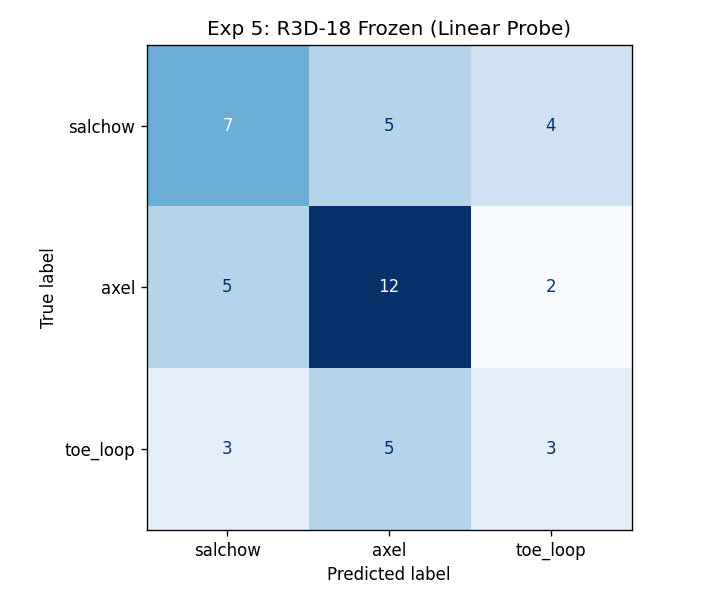
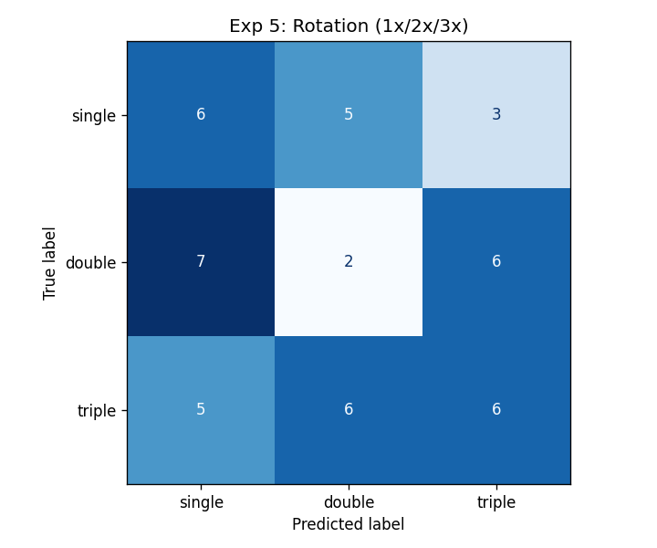

```
Best val type acc:   47.8%  (epoch 3)
Val rotation acc:    30.4%  (at best type epoch)
Early stopping:      epoch 15 (patience=12)
```

#### Analysis

The training curves are flat almost from the start: the model reaches its best by epoch 3 and then barely moves, with near-zero train/val gap. This is characteristic of a frozen model with very few trainable parameters (~3K) — there simply isn't enough capacity to overfit or to improve significantly beyond the initial linear fit.

Type accuracy (47.8%) falls below Exp 1's LSTM result (50.0%), confirming an important point: R3D-18's single avgpool output vector is less useful than an LSTM over 16 per-frame ResNet18 vectors. The 3D avgpool collapses all temporal information — any discriminative cue at the takeoff frame gets diluted by the 15 other frames. The LSTM in Exp 1 learns to weight frames differently and retain the takeoff-frame signal.

Rotation accuracy (30.4%) is near-random and confirms the worst suspicion: Kinetics features as a single vector do not encode rotation periodicity at all. The entire rotation signal — the cyclic oscillation of joint positions — is averaged out in the temporal pooling.

Together, Exp 4 and Exp 5 answer the R3D-18 question conclusively: **the 3D video pretraining doesn't transfer well to rotation counting, and the dataset is too small for full fine-tuning to work.** LSTM over per-frame 2D features (Exp 1) beats both variants.

With the PyTorch experiments completed, a new question emerges: *how reliable are these single-split numbers really? Is 50–55% a real result or a 46-example coincidence?*

---

### Exp 6 — Sklearn: Combined Features

**Files:** `train_sklearn.py`
**Report:** `reports/figures/exp6_sklearn/`

#### Why we tried this — and why k-fold is crucial here

After five PyTorch experiments, accuracy estimates range from 47.8% to 55.3% — but every number is measured on the same 46 validation examples. One correct prediction = +2.2pp. Results could vary by 10pp or more from a different random split.

We need a more honest answer: **what is the real accuracy ceiling for jump type classification with the features we've extracted?**

Sklearn on precomputed features makes this practical. Running 5-fold cross-validation across all 305 videos takes seconds on CPU — something that would take 25+ minutes per PyTorch experiment (5× full retraining from scratch, ~26 epochs each). The 5-fold CV gives five independent measurements, each with a different 244/61 train/test split, producing a mean accuracy with a meaningful confidence interval.

*Why isn't k-fold used for the PyTorch experiments too?* Simply because of compute cost. Validating five LSTM experiments × 5 folds × ~20 epochs each would take 2+ hours of extra training on top of the exploratory runs. The sklearn results from Exp 6 serve as the ground-truth estimate for what's achievable.

*Note: rotation classification is not implemented here — it requires temporal frame-by-frame modelling, which doesn't fit the single global feature vector format used in this sklearn pipeline.*

#### Base feature vector (1366-d)

| Feature             | Source                          | Dim | How                                    |
|---------------------|---------------------------------|-----|----------------------------------------|
| R3D-18 video        | frozen backbone avgpool         | 512 | `extract_video_features.py`            |
| Pose (mean/std/vel) | MediaPipe landmarks             | 297 | mean(99) + std(99) + mean\|delta\|(99) |
| Optical flow        | Farneback dense, 15 pairs       | 45  | [mean_u, mean_v, mean_mag] × 15        |
| Local crop          | ResNet18 on bottom-50% of frame | 512 | takeoff frame via min(mean_v)          |

#### Ablation — what does each feature actually contribute?

The ablation (LogReg C=0.05, 5-fold CV) removes feature groups one at a time to measure individual contribution:

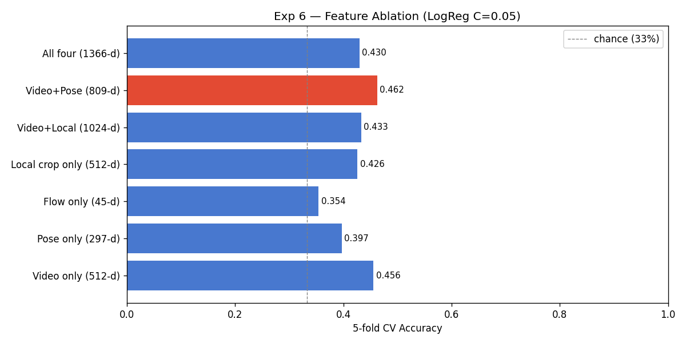

| Feature set      | Dim     | CV acc    | ±std      |
|------------------|---------|-----------|-----------|
| Video only       | 512     | **45.6%** | ±3.5%     |
| Pose only        | 297     | 39.7%     | ±3.0%     |
| Flow only        | 45      | 35.4%     | ±7.6%     |
| Local crop only  | 512     | 42.6%     | ±6.1%     |
| Video + Local    | 1024    | 43.3%     | ±6.2%     |
| **Video + Pose** | **809** | **46.2%** | **±3.2%** |
| All four         | 1366    | 43.0%     | ±1.2%     |

The counterintuitive result: **adding more features hurts accuracy.** Video alone achieves 45.6%; combining all four drops to 43.0%. This is the curse of dimensionality — with 305 examples and a 1366-dimensional feature space, a linear classifier is overwhelmed by noisy dimensions faster than it benefits from extra signal.

The one combination that helps is Video + Pose (46.2%), where pose features add complementary body-orientation information without excessive dimensionality. Optical flow and local crop add noise for a linear model.

#### Grid search on all available features

The grid search ran on 2902-d (all feature variants including YOLO and bottom crops):

| Classifier   | CV acc    | ±std  |
|--------------|-----------|-------|
| LogReg C=0.1 | **44.9%** | ±2.7% |
| SVM RBF C=1  | 42.3%     | ±1.9% |
| SVM RBF C=10 | 43.6%     | ±5.1% |

Even SVM with an RBF kernel — which can learn non-linear boundaries that ignore noisy dimensions — does not exceed the simpler Video+Pose combination (46.2%). The ceiling for any classifier on these global features is approximately 46%.

#### Confusion matrix (LogReg C=0.1, out-of-fold, 305 videos)

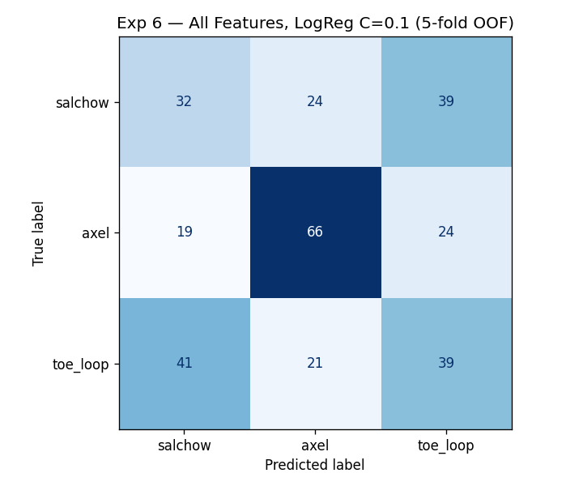

```
              precision  recall  f1    support
salchow           0.35    0.34   0.34    95
axel              0.59    0.61   0.60   109
toe_loop          0.38    0.39   0.38   101
accuracy                         0.45   305
```

The confusion matrix makes the Salchow/Toe Loop problem concrete: of 95 true Salchow examples, **39 are predicted as Toe Loop** (41%). Of 101 true Toe Loop examples, **41 are predicted as Salchow** (41%). This bidirectional confusion is consistent with the hypothesis that these two jumps are globally identical at the feature level used here, differing only in a blade-contact detail that our feature pipeline appears unable to capture.

**The 46.2% cross-validation result (Video+Pose) provides the most statistically stable estimate** among the evaluated global-feature approaches. It is based on 5-fold CV across all 305 videos rather than a single 46-example split. The single-split results from Exp 1–5 (47–55%) are not statistically distinguishable from this figure given the evaluation set size, and should be interpreted as suggestive rather than definitive.

---

### Exp 7 — YOLO Zero-Shot Diagnostic + Crop Variant Ablation

**Files:** `yolo_zeroshot_test.py`, `extract_bottom_frames.py`, `extract_local_features.py --bottom`, `extract_yolo_features.py --bottom`
**Report:** `reports/figures/yolo_zeroshot/`, `reports/figures/exp6_sklearn/ablation_yolo_bar_chart.png`

#### Can we see the blade if we look harder?

The local crop features (bottom 50% of center-cropped frame) achieved only 42.6% — barely useful. We had two hypotheses for why:
1. The heuristic crop is too imprecise — a tighter YOLO crop around the actual blade contact area would help
2. The center crop itself misses the blade entirely for portrait videos

**Hypothesis 2 has a basis:** for 576×1024 portrait video, resizing to 256×455 and center-cropping to 224×224 covers original pixels y=256..758. Ice contact happens at approximately y=700–1020 — the **bottom 25% of the frame**, partially outside the center crop. A bottom-biased crop (centring the 224px window at 75% height) would cover y≈514–1018, capturing the critical takeoff zone.

#### Part A: YOLO Zero-Shot Test

YOLOv11n run zero-shot (no fine-tuning) on 5 takeoff frames per class:

| Class    | Det. rate | Avg confidence | Avg person bbox | Avg blade crop |
|----------|-----------|----------------|-----------------|----------------|
| Salchow  | 100%      | 0.690          | 16.5% of frame  | 5.0% of frame  |
| Axel     | 100%      | 0.798          | 22.6% of frame  | 6.8% of frame  |
| Toe Loop | 100%      | 0.721          | 12.7% of frame  | 3.9% of frame  |

**100% detection with no fine-tuning needed.** The YOLO blade crop is **10× tighter** than the bottom-50% heuristic.

#### Part B: Crop Variant Ablation

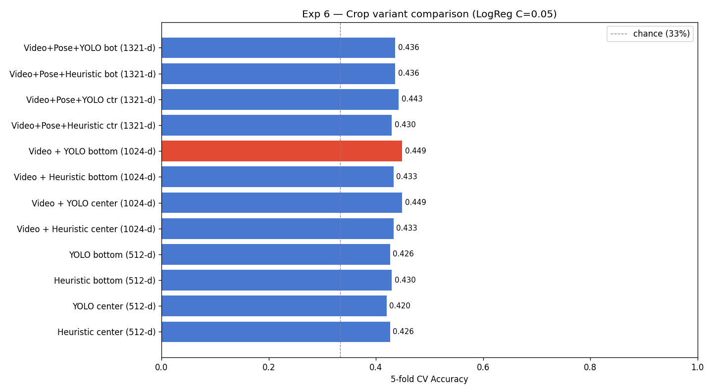

**Single-stream (512-d each):**

| Crop variant                | CV acc | ±std  |
|-----------------------------|--------|-------|
| Heuristic center (baseline) | 42.6%  | ±6.1% |
| YOLO center                 | 42.0%  | ±3.2% |
| Heuristic bottom            | 43.0%  | ±4.1% |
| YOLO bottom                 | 42.6%  | ±3.9% |

**Combined with Video (1024-d):**

| Combination              | CV acc | ±std  |
|--------------------------|--------|-------|
| Video + Heuristic center | 43.3%  | ±6.2% |
| Video + YOLO center      | 44.9%  | ±4.2% |
| Video + Heuristic bottom | 43.3%  | ±4.9% |
| Video + YOLO bottom      | 44.9%  | ±2.9% |

#### Analysis

The results consistently show that **crop quality alone does not improve performance.** All four crop strategies — different tightness, different vertical position — cluster between 42% and 43% standalone and 43–45% combined with video features. The differences between strategies are within the noise of the ±std range.

A likely explanation: even the tightest YOLO crop (3.9–6.8% of frame) must be upscaled approximately 22× to reach 224×224 before passing through ResNet18. At that magnification, the sub-10-pixel blade edge difference between Salchow and Toe Loop is likely dominated by bilinear interpolation artefacts. The results suggest that the discriminative signal is largely lost during the resolution reduction and feature extraction process.

These findings suggest that crop positioning is not the primary bottleneck, and that resolving the Salchow/Toe Loop distinction may require either higher-resolution source footage or a fundamentally different sensing approach.

---

### Exp 8 — Final Hybrid Model

**Files:** `ai_training/final_model.py`
**Checkpoints:** `checkpoints/final_logreg_type.pkl`, `checkpoints/best_pose_model_rotation.pth`

#### Motivation

Experiments 1–7 evaluated each approach independently on either type or rotation, but the two best-performing components were trained in isolation. Exp 8 combines them into a single inference pipeline:

- **Jump type** → LogReg on Video+Pose features (Exp 6 best combination: 46.2% CV)
- **Rotation count** → Pose BiLSTM at its best rotation epoch (Exp 3: 63.0% val)

No new training is required. The pipeline loads the already-trained sklearn pipeline and the best-rotation BiLSTM checkpoint.

#### Architecture

```
Input: pre-processed video clip
    │
    ├─ R3D-18 (frozen)  ──────────────────────── 512-d video feature
    │
    └─ MediaPipe pose ── (T, 99) landmark sequence
              │
              ├── aggregate: mean + std + mean|Δ|  → 297-d
              │       │
              │       └── concat with video (809-d) → LogReg C=0.05 ── jump type
              │
              └── raw (T, 99) → BiLSTM (best rotation checkpoint) ── rotation count
```

#### Results

| Task      | Model                             | Accuracy | Evaluation protocol           |
|-----------|-----------------------------------|----------|-------------------------------|
| Jump type | LogReg (Video+Pose, C=0.05)       | 46.2%    | 5-fold CV, 305 videos         |
| Rotation  | Pose BiLSTM (best rotation epoch) | 63.0%    | Val set, 46 videos (held out) |

The type estimate (46.2%) is the CV score from Exp 6 — the most statistically stable available figure. The rotation estimate (63.0%) is from the current checkpoint evaluated on the held-out val set. As noted in Exp 3, rotation accuracy shows ~5pp run-to-run variance.

#### Usage

```
from ai_training.final_model import FinalModel

model = FinalModel()

# From precomputed features (stem = video filename without extension)
result = model.predict_from_stem("axel_clip_001")

# From raw arrays
result = model.predict(video_feat, pose_seq)  # (512,) and (T, 99)

# result →
# {
#   "type": "axel",       "type_proba": {"salchow": 0.08, "axel": 0.79, "toe_loop": 0.13},
#   "rotation": "triple", "rotation_proba": {"single": 0.03, "double": 0.12, "triple": 0.85},
# }
```

Quick sanity check on val set: `python ai_training/final_model.py`

#### Notes

The LogReg component was fitted on all 305 videos after CV hyperparameter selection. Evaluating it on those same 305 videos produces inflated accuracy — this is expected and does not indicate overfitting in the usual sense; it reflects that the model was intentionally trained on all available data for deployment. The 46.2% CV figure is the appropriate accuracy estimate.

The BiLSTM uses the checkpoint saved at the best rotation epoch (epoch 17), not the best type epoch (epoch 12). These differ because the joint loss encourages both tasks simultaneously, and each task peaks at a different point in training.

---

## 4. Results Summary

### Jump type + rotation accuracy

| Experiment              | Model                                 | Val acc (type) | Val acc (rotation) | CV acc    | Notes                                       |
|-------------------------|---------------------------------------|----------------|--------------------|-----------|---------------------------------------------|
| Exp 1 — Baseline        | ResNet18+LSTM frozen                  | 50.0%          | 39.1%              | —         | Clean training, no overfitting              |
| Exp 2 — layer4 FT       | ResNet18+LSTM partial FT              | 55.3%          | 45.7%              | —         | Overfits: train >80%                        |
| **Exp 3 — Pose LSTM**   | **BiLSTM on landmarks**               | **54.4%**      | **63.0%**          | —         | **Best rotation; ~5pp run-to-run variance** |
| Exp 4 — R3D-18 full FT  | R3D-18 33M params                     | 50.0%          | 43.5%              | —         | Extreme overfit: train 98%                  |
| Exp 5 — R3D-18 frozen   | Linear probe ~3K params               | 47.8%          | 30.4%              | —         | No temporal aggregation                     |
| **Exp 6 — Sklearn**     | **LogReg / SVM on features**          | —              | n/a                | **46.2%** | **Most statistically stable type estimate** |
| Exp 7 — Crop variants   | 4 crop strategies, sklearn            | —              | n/a                | 42–45%    | Crop quality not a differentiating factor   |
| **Exp 8 — Final Model** | **LogReg (type) + BiLSTM (rotation)** | **46.2% CV**   | **63.0%**          | **46.2%** | **Combined inference pipeline**             |

Random baseline for all tasks: **33.3%** (3 classes: single / double / triple).

### The rotation finding

**Pose LSTM (Exp 3) achieves 63.0% rotation accuracy** (current checkpoint; see Exp 3 note on run-to-run variance) — 30pp above random, and consistently higher than any video-based model in this study. All video-based models (Exp 1, 2, 4, 5) reach only 30–46%. These results suggest that rotation information is more accessible in landmark velocity trajectories than in the video features evaluated here.

### Ranking by reliability (type classification)

```
55.3%  Exp 2  ResNet18 layer4 FT   — single-split; train >80% — likely overfitting artifact
54.4%  Exp 3  Pose LSTM            — single-split; ±5–8pp uncertainty on 46 examples
50.0%  Exp 1  ResNet18+LSTM frozen — single-split; ±5pp uncertainty
50.0%  Exp 4  R3D-18 full FT      — train 98% vs val 50% — extreme overfitting
47.8%  Exp 5  R3D-18 frozen probe  — no temporal aggregation; single-split
46.2%  Exp 6  Sklearn 5-fold CV   — most statistically stable; based on all 305 videos
```

### Reading the numbers correctly

- **Single-split val numbers** (Exp 1–5) are on 46 examples. Each correct prediction = +2.2pp. These carry ±5–8% confidence intervals — a 55.3% result and a 50.0% result are not statistically distinguishable at this sample size, and should be read as approximate rather than precise.
- **46.2% from Exp 6** (5-fold CV, 305 videos) is the most statistically stable type estimate. It represents a realistic expectation for global-feature approaches on this dataset, though it cannot be treated as a hard ceiling — different modalities or larger datasets could potentially exceed it.
- **Rotation accuracy** is on the same 46-example val set — numbers are indicative, not conclusive. Exp 3's 63.0% is 30pp above chance, which is a meaningful signal despite the small sample size; however, exact comparisons between runs should account for ~5pp variance.

---

## 5. Cross-Experiment Analysis

### The stable confusion pattern

Every experiment, regardless of modality, produces the same confusion structure:

```
          predicted
          salchow  axel  toe_loop
actual
salchow    ~32%    ~25%    ~43%     ← confused with toe_loop
axel        ~9%    ~61%    ~17%     ← best separated
toe_loop   ~41%    ~21%    ~38%     ← confused with salchow
```

This pattern is consistent across all experiments and modalities, suggesting it reflects a property of the feature representations rather than a modelling failure. Axel's forward takeoff is consistently captured; Salchow and Toe Loop remain confused — consistent with the hypothesis that the distinguishing blade-contact detail is not reliably encoded in the features evaluated here.

### Why rotation accuracy is higher than type accuracy — a consistent pattern

The ~11pp gap between rotation (63.0%) and type (54.4%) from Exp 3's model on the same val set is consistent with different information availability across the two tasks:

- **Jump type** requires distinguishing blade-contact geometry — a detail that appears to be at or below the resolution limit of the features used here
- **Rotation count** involves counting body spin cycles — a signal that appears to be more accessible in landmark velocity trajectories as rhythmic oscillation of wrist, shoulder, and hip positions

At 25fps source video, one rotation takes approximately 5–8 frames. A BiLSTM over 16 pose frames has potential access to this periodic signal. Video-based models reach only 30–46% rotation — consistent with the hypothesis that the global avgpool vector loses the frame-by-frame periodicity that the BiLSTM can exploit.

### Why temporal aggregation determines type accuracy

| Approach             | Temporal aggregation            | Type result             |
|----------------------|---------------------------------|-------------------------|
| Pose BiLSTM          | BiLSTM over per-frame landmarks | 54.4% (single-split)    |
| ResNet18+LSTM frozen | LSTM over per-frame features    | 50.0% (single-split)    |
| Sklearn 5-fold CV    | None (single global vector)     | 46.2% CV                |
| R3D-18 frozen probe  | None (single global vector)     | 47.8%                   |
| ResNet18 layer4 FT   | LSTM, but backbone memorised    | 55.3% (overfit)         |
| R3D-18 full FT       | 3D convolutions, but memorised  | 50.0% (extreme overfit) |

The pattern is clear: models with temporal aggregation (LSTM, BiLSTM) outperform those without (single global vector), both for type and rotation.

---

## 6. Conclusions

### What we learned

This project started with a simple question: can you tell a figure skating jump from a TikTok video? The answer is a qualified yes — but the ceiling is lower than expected for type, and higher than expected for rotation.

**Jump type** classification proved difficult across all approaches tested: frozen ImageNet features, fine-tuned 3D video models, and YOLO-guided blade crops all converge to approximately 46% accuracy. The ~27pp gap between Axel recall (61%) and Salchow/Toe Loop recall (34–39%) is stable across experiments, suggesting that the current feature representations do not encode the discriminating blade-contact information — though whether this is a fundamental limit or an artefact of the resolution and feature choices here remains an open question.

**Rotation count** was more tractable than expected. The BiLSTM on pose landmarks achieved 63.0% val accuracy (30pp above random), with some additional variance between runs. Body spin appears to create a measurable signal in landmark velocity trajectories that is not accessible from aggregated video features. This is the most actionable result of the study.

**A notable observation:** a ~200K parameter model (Pose BiLSTM) achieves stronger results than a 33M parameter model (R3D-18 fully fine-tuned) on both tasks. This is consistent with the importance of feature representation over model capacity in low-data regimes.

### What works right now

- **Axel detection**: 61% recall with any global feature. A binary "is this an Axel?" classifier is achievable today.
- **Rotation counting with pose**: 63.0% on single/double/triple (current checkpoint; see Exp 3 note on run-to-run variance). The signal appears consistent across runs.
- **Frozen pretrained backbones**: ImageNet (ResNet18) and Kinetics (R3D-18) transfer well without fine-tuning.
- **LSTM temporal aggregation**: consistently outperforms single global vectors for both tasks.

### What doesn't work — and why

- **Full fine-tuning on small datasets**: fine-tuning 2M+ backbone parameters on 213 clips causes immediate overfitting. Not beneficial below ~1000 examples per class.
- **Optical flow as global statistics**: Farneback mean over 224×224 averages out the signal. The flow *direction* at the takeoff frame matters; the mean discards this.
- **Local crop features for type**: the discriminative blade detail appears to be largely unresolvable at 224×224 with the current feature pipeline. Tested across four crop strategies in Exp 7 — heuristic, YOLO, center, bottom — with no consistent improvement.

### What would break the ceiling

| Path                                           | Expected impact                              | Effort |
|------------------------------------------------|----------------------------------------------|--------|
| 1000+ labelled clips per class                 | High — only robust fix for type              | High   |
| 4K source footage + tight skate crop           | Medium-high — blade becomes >50px            | Medium |
| Expert-annotated exact takeoff frame           | Medium — eliminates frame-detection error    | High   |
| Binary axel detector only                      | High for axel (70-80% recall)                | Low    |
| LSTM cross-validated (5-fold)                  | Would verify true LSTM advantage             | Low    |
| Video foundation model (VideoMAE, InternVideo) | Unknown                                      | Medium |
| Optical flow curl component                    | Medium for rotation — measures spin directly | Low    |

---

## 7. Feature Extraction Details

### R3D-18 video features (512-d)
`extract_video_features.py` — R3D-18 pretrained on Kinetics-400, drop final FC, avgpool output. One 512-d vector per video.

### Optical flow features (45-d)
`extract_flow_features.py` — Farneback dense optical flow between 15 consecutive frame pairs. Per pair: [mean_u, mean_v, mean_magnitude] → 45-d. Denormalises ImageNet tensors to grayscale uint8 first.

### Local crop features (512-d) — center and bottom variants
`extract_local_features.py` (and `--bottom` variant):
1. Find takeoff frame: `argmin(mean_v)` over 15 flow pairs → frame pair with most upward motion
2. Take 4 frames centred on takeoff
3. Crop bottom 50% of frame, resize to 224×224
4. Frozen ResNet18 → 512-d, averaged across 4 frames

### YOLO blade crop features (512-d) — center and bottom variants
`extract_yolo_features.py` (and `--bottom` variant):
1. Same takeoff detection as local crop
2. For each of 4 takeoff frames: YOLOv11n detects person → crop bottom 30% of person bbox
3. Falls back to heuristic (bottom-50%) if no person detected (4.9% of frames)
4. Frozen ResNet18 → 512-d, averaged across 4 frames

### Pose features (297-d for sklearn)
Raw pose `.npy` files are `(T, 99)`. Aggregated as mean(99) + std(99) + mean|delta|(99) = 297-d. `StandardScaler` in the sklearn pipeline.

---

## 8. Runtime Notes

### Running the pipeline

```bash
python run_all.py                   # full pipeline from raw videos to debug videos
python run_all.py --skip-prep       # skip registry + frame extraction + poses
python run_all.py --skip-features   # skip feature extraction
python run_all.py --skip-training   # skip all training
python run_all.py --skip-debug      # skip debug video generation
python run_all.py --exp 5           # only experiment 5 (no prep/debug)
python run_all.py --force-prep      # re-extract frames even if already done
python run_all.py --yolo-test       # YOLO zero-shot diagnostic only
```

Skip logic: if `checkpoints/best_model_X.pth` exists, that experiment is skipped. Feature extraction skips already-processed files.

### Debug videos

Generated by `make_debug_videos.py` for all experiments (exp1–exp7). Each video shows:
- **Left panel**: original frame with colored border by jump phase (gray=pre-takeoff, green=takeoff, orange=flight, blue=landing). Takeoff frame marked with star.
- **Right panel**: confidence bars for each jump type + rotation bars (single/double/triple for PyTorch models), ground truth, prediction, CORRECT/WRONG indicator.

Saved to: `videos/{exp}/train/*.mp4` and `videos/{exp}/val/*.mp4`

### YOLO diagnostic
`python run_all.py --yolo-test` — runs zero-shot YOLO diagnostic, saves grids to `reports/figures/yolo_zeroshot/`. Requires `pip install ultralytics` (YOLOv11n downloads automatically).

### Known issue: Exp 3 exit code 3221226505
Pose LSTM may exit with Windows `STATUS_STACK_BUFFER_OVERRUN` after saving all outputs — a Windows-specific crash in Python/matplotlib/CUDA cleanup, not a training error. All outputs are saved before the crash.

### Hardware
- GPU: NVIDIA GeForce RTX 5070 Ti Laptop GPU (11.9 GB VRAM)
- All PyTorch experiments run on CUDA; sklearn on CPU

---

## 9. Sample Frames

One video per class — takeoff, mid-air, and landing phases.

### Salchow
| Takeoff | Mid-air | Landing |
|---|---|---|
| 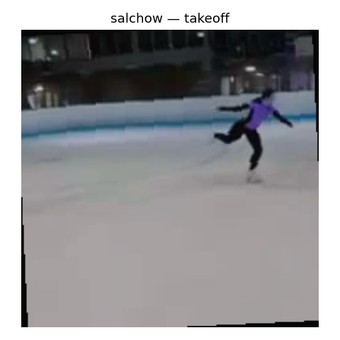 | 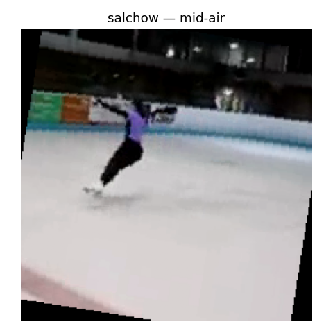 | 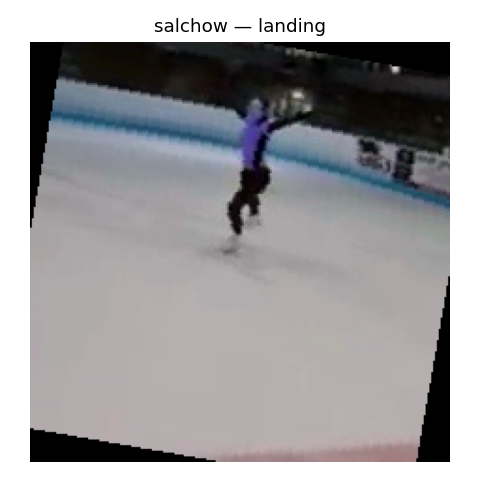 |

### Axel
| Takeoff | Mid-air | Landing |
|---|---|---|
| 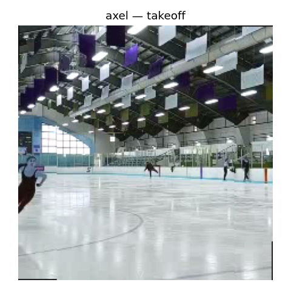 | 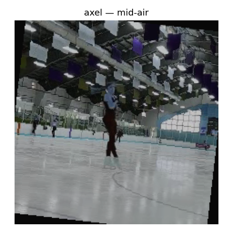 | 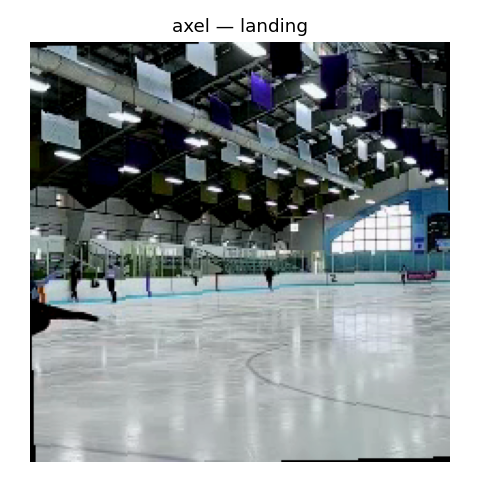 |

### Toe Loop
| Takeoff | Mid-air | Landing |
|---|---|---|
| 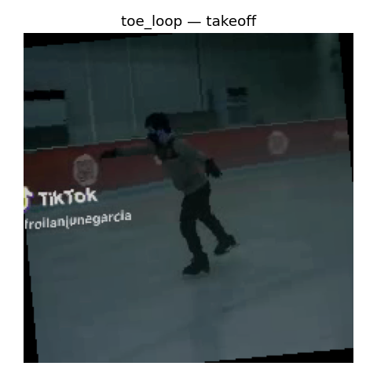 | 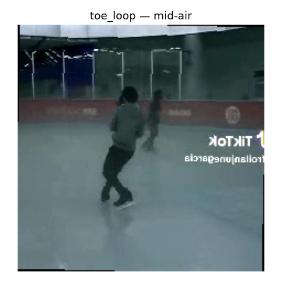 | 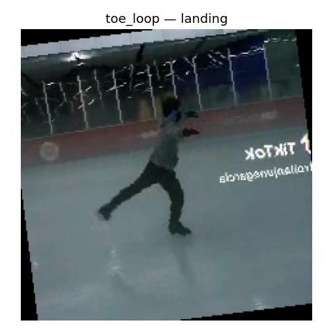 |