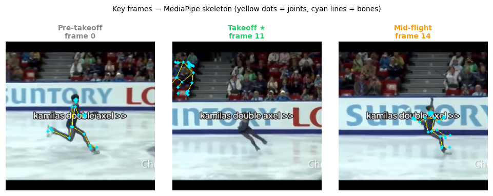
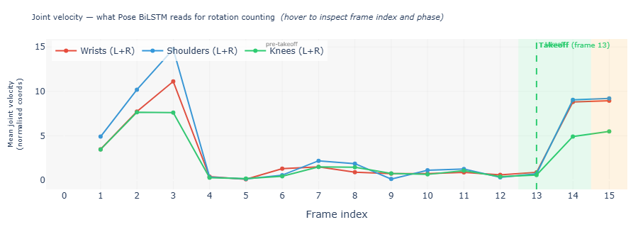
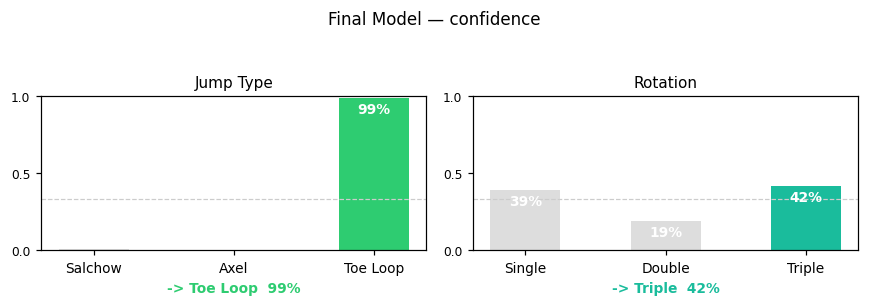

# Figure Skating Jump Recognition

Classifies figure skating jumps (salchow, axel, toe loop) from short video clips — and counts rotations (single/double/triple).

This is a deliberately difficult small-data research problem: the discriminative visual cue between two of the three classes (salchow vs. toe loop) is the blade edge at takeoff — a sub-10-pixel region at 224×224 resolution that no global feature representation can reliably capture. The goal is not to maximise accuracy, but to systematically understand *why* accuracy is limited and what architectural choices matter within those constraints.

---

## Problem

Given a short video clip of a figure skating jump, predict:
1. Jump type: Salchow / Axel / Toe Loop
2. Rotation count: single / double / triple

| Label | Class | Count |
|---|---|---|
| 0 | Salchow | 95 |
| 1 | Axel | 109 |
| 2 | Toe Loop | 101 |
| 3 | Failed (excluded from training) | 14 |

**Core difficulty**: salchow vs. toe loop differ only in which blade edge contacts the ice at takeoff — a sub-10-pixel detail at 224×224 resolution. Axel is uniquely recognisable because it is the only jump with a forward approach, producing a distinctive global motion signature.

**Best type accuracy** (reliable, 5-fold CV): **46.2%** (Exp 6 — Video+Pose, 305 videos).  
**Best type accuracy** (single-split val): **54.4%** (Exp 3 Pose BiLSTM, no overfitting).  
**Best rotation accuracy**: **67.4%** (Exp 3 Pose BiLSTM) — 34pp above chance.  
Val set has 46 examples = 2.2pp per prediction — single-split numbers carry ±5–8pp confidence intervals.

---

## Results

| Experiment | Architecture | Val acc (type) | Val rot acc | CV acc | Notes |
|---|---|---|---|---|---|
| Exp 1 — Baseline | ResNet18+LSTM (frozen) | 50.0% | 39.1% | — | Clean training, no overfitting |
| Exp 2 — layer4 FT | ResNet18+LSTM partial FT | 55.3% | 45.7% | — | Overfits: train >80% |
| **Exp 3 — Pose LSTM** | **BiLSTM on landmarks** | **54.4%** | **67.4%** | — | **Best rotation; ~200K params** |
| Exp 4 — R3D-18 full FT | R3D-18 33M params | 50.0% | 43.5% | — | Extreme overfit: train 98% vs val 50% |
| Exp 5 — R3D-18 frozen | Linear probe ~3K params | 47.8% | 30.4% | — | No temporal aggregation |
| **Exp 6 — Sklearn** | **LogReg / SVM on features** | — | n/a | **46.2%** | **Most reliable type estimate** |
| Exp 7 — Crop variants | 4 crop strategies, sklearn | — | n/a | 42–45% | Crop quality not the bottleneck |

Random baseline for all 3-class tasks: **33.3%**

### Sklearn ablation (5-fold CV, LogReg C=0.05)

| Feature set | Dim | CV acc |
|---|---|---|
| Video only (R3D-18) | 512 | 45.6% ± 3.5% |
| Pose only | 297 | 39.7% ± 3.0% |
| Flow only | 45 | 35.4% ± 7.6% |
| Local crop only | 512 | 42.6% ± 6.1% |
| Video + Pose | 809 | **46.2% ± 3.2%** |
| All four | 1366 | 43.0% ± 1.2% |

Best robust type estimate: **Video+Pose, LogReg → 46.2% (5-fold CV)**  
Best single-split type: **Pose BiLSTM → 54.4% val** (no overfitting, see Exp 3)  
Best rotation: **Pose BiLSTM → 67.4% val** (see Exp 3)

### Confusion pattern (stable across all experiments)


```
              precision  recall  f1
salchow           0.35    0.34   0.34   ← confused with toe_loop
axel              0.59    0.61   0.60   ← best: unique forward approach
toe_loop          0.38    0.39   0.38   ← confused with salchow
```

### Feature ablation


---

## Dataset

- **305 videos** (train 213 / val 46 / test 46, stratified by class)
- Videos downloaded from YouTube / TikTok, trimmed to one jump per clip
- Frames pre-extracted as `(3, 224, 224)` float32 `.npy`, ImageNet-normalised
- 16 frames sampled per clip (uniform in eval, random segment in train)

```
data/
├── Axel/, Salchow/, Toe Loop/, Failed/   ← raw source videos
├── frames/                               ← .npy frames + metadata JSONs
│   ├── dataset_metadata_train.json
│   ├── dataset_metadata_val.json
│   └── dataset_metadata_test.json
├── frames_bottom/                        ← bottom-biased crop frames (same structure)
├── poses/               ← MediaPipe pose sequences       (305 × .npy, shape T×99)
├── features/            ← R3D-18 video embeddings        (319 × 512-d .npy)
├── features_flow/       ← optical flow features          (319 × 45-d .npy)
├── features_local/      ← bottom-crop ResNet18 embeddings (512-d .npy)
├── features_local_bottom/ ← local crop on bottom frames  (512-d .npy)
├── features_yolo/       ← YOLO blade crop embeddings     (512-d .npy)
└── features_yolo_bottom/  ← YOLO crop on bottom frames   (512-d .npy)
```

---

## Architecture

### Feature extraction pipeline

```
Raw clip → pre-extracted frames: (T, 3, 224, 224) float32, ImageNet-normalised
    │
    ├── extract_video_features.py   frozen R3D-18 avgpool  →  (512,) per video
    ├── extract_flow_features.py    Farneback dense flow   →  (45,)  per video
    │                               15 pairs × [mean_u, mean_v, mean_mag]
    ├── extract_local_features.py   takeoff detection      →  (512,) per video
    │                               argmin(mean_v) → 4-frame window →
    │                               bottom-50% crop → ResNet18 avgpool
    ├── extract_yolo_features.py    YOLO blade crop        →  (512,) per video
    │                               same takeoff detection → bottom-30% of person bbox
    └── extract_poses.py            MediaPipe Tasks API    →  (T, 99) per video
                                    33 landmarks × (x, y, visibility)
```

### PyTorch models

All PyTorch models output two heads: jump type (3-class) and rotation count (3-class: single/double/triple). Joint loss = CE(type) + 0.5 × CE(rotation). Rotation labels {1,2,3} from the dataset are remapped to {0,1,2} at training time.

**Exp 1 — ResNet18+LSTM** (`model.py`): ResNet18 frozen → per-frame 512-d → LSTM(128) → last+mean pooling → BN → 3-class type head + 3-class rotation head.

**Exp 2 — ResNet18+LSTM unfrozen** (`model_a.py`): Same but `layer4` + avgpool trainable at LR 1e-5. 4-class type (includes failed).

**Exp 3 — Pose BiLSTM** (`pose_model.py`): Linear(99→128) + ReLU → BiLSTM(256, 2-layer) → last+mean pooling → LayerNorm → 3-class heads. ~200K params.

**Exp 4+5 — R3D-18** (`model_b.py`): R3D-18 backbone → BN(512) → Dropout(0.3) → 3-class heads. `freeze_backbone=True/False`.

---

## Project Structure

```
figure_skating_jump_recognition/
├── ai_training/
│   ├── dataset.py               ← FigureSkatingDataset (.npy frames + augmentation)
│   ├── model.py                 ← ResNet18+LSTM  [Exp 1]
│   ├── model_a.py               ← ResNet18+LSTM layer4 unfrozen  [Exp 2]
│   ├── model_b.py               ← R3D-18 heads  [Exp 4, 5]
│   ├── pose_dataset.py          ← PoseDataset (.npy pose sequences)
│   ├── pose_model.py            ← BiLSTM on pose  [Exp 3]
│   ├── train.py                 ← Exp 1
│   ├── train_a.py               ← Exp 2
│   ├── train_pose.py            ← Exp 3
│   ├── train_b_finetune.py      ← Exp 4 (full fine-tuning)
│   ├── train_b.py               ← Exp 5 (frozen linear probe)
│   ├── train_sklearn.py         ← Exp 6 (ablation + grid search)
│   ├── extract_video_features.py
│   ├── extract_flow_features.py
│   ├── extract_local_features.py
│   ├── extract_bottom_frames.py ← bottom-biased crop frame extraction  [Exp 7]
│   ├── extract_yolo_features.py ← YOLO-guided blade crop features      [Exp 7]
│   ├── make_debug_videos.py     ← annotated MP4 debug videos per experiment
│   ├── yolo_zeroshot_test.py    ← YOLO zero-shot diagnostic            [Exp 7]
│   ├── reporting_utils.py       ← shared: save_training_curves, save_confusion_matrix
│   └── checkpoints/             ← .pth + history.json (auto-created)
├── pose_extraction/
│   └── extract_poses.py         ← MediaPipe Tasks API
├── reporting/
│   └── save_sample_frames.py    ← 3 frames per class (takeoff / mid-air / landing)
├── reports/figures/
│   ├── exp1_baseline/           ← training_curves.png, confusion_matrix.png, confusion_matrix_rotation.png
│   ├── exp2_resnet_finetune/
│   ├── exp3_pose_lstm/
│   ├── exp4_r3d18_full/
│   ├── exp5_r3d18_frozen/
│   ├── exp6_sklearn/            ← ablation_bar_chart.png, ablation_yolo_bar_chart.png,
│   │                               grid_search_bar_chart.png, confusion_matrix.png
│   ├── yolo_zeroshot/           ← YOLO detection grids per class
│   └── sample_frames/           ← {class}_{takeoff|mid-air|landing}.png
├── demo/                        ← demo application
├── videos/                      ← debug MP4s: {exp}/train/*.mp4, {exp}/val/*.mp4
├── video_download/
│   └── yt_download.py
├── run_all.py                   ← master pipeline
├── build_registry.py
├── registry.json                ← video labels (jump type, rotation, fall)
└── EXPERIMENTS.md               ← full experiment log with all results
```

---

## Running

### Full pipeline
```bash
python run_all.py
```
Runs registry build → frame extraction → feature extraction → all experiments → debug videos. Skips any step whose output already exists.

### Flags
```bash
python run_all.py --skip-prep       # skip registry + frame extraction + poses
python run_all.py --skip-features   # skip feature extraction
python run_all.py --skip-training   # skip all training
python run_all.py --skip-debug      # skip debug video generation
python run_all.py --exp 5           # only experiment 5 (no prep/debug)
python run_all.py --force-prep      # re-extract frames even if already done
python run_all.py --yolo-test       # YOLO zero-shot diagnostic only (Exp 7)
```

### Re-run a specific experiment from scratch
Delete the checkpoint, then run:
```bash
del ai_training\checkpoints\best_model_b.pth
python run_all.py --exp 5
```

### Run training scripts directly (from ai_training/)
```bash
cd ai_training
python train_b.py          # Exp 5
python train_sklearn.py    # Exp 6 (always fast, no checkpoint skip)
```

---

## Dependencies

```
torch >= 2.0
torchvision
scikit-learn
mediapipe >= 0.10
opencv-python
matplotlib
numpy
tqdm
ultralytics
yt-dlp
```

---

## Key Findings

1. **LSTM temporal aggregation is the decisive factor.** ResNet18 (frozen ImageNet) + LSTM = **50.0% val**, while R3D-18 (frozen Kinetics, better backbone) + linear probe = **47.8%**. The difference is not the backbone — it's that the LSTM retains 16 per-frame feature vectors and learns which frames matter, while the linear probe sees only a single global avgpool.

2. **Freeze the backbone.** Exp 2 (ResNet18 layer4 FT, train >80%, overfits by epoch 12) and Exp 4 (R3D-18 full FT, train 98% vs val 50%) both show severe overfitting. Pretrained features already encode enough motion structure; fine-tuning 2–33M params on 213 clips corrupts them.

3. **Axel is the only reliably separable class** (~61% recall across all experiments) because its forward approach is a visible global motion cue. Salchow vs. toe loop differ only at the blade contact point — a sub-10-pixel region that no global feature can capture.

4. **46.2% is the robust ceiling for linear/kernel classifiers** (5-fold CV on 305 videos). Single-split val numbers carry ±5–8pp confidence intervals on 46 examples.

5. **Rotation counting is structurally easier than type.** Pose BiLSTM achieves **67.4% rotation accuracy** — 34pp above chance — while the same model reaches only 54.4% on type. Body spin creates a measurable periodic signal in joint velocities; blade edge geometry does not survive 224×224 downscaling.

6. **Adding features hurts with linear classifiers** — all four features combined (1366-d) performs worse than video alone (512-d) or video+pose (809-d) with LogReg. Curse of dimensionality with 305 examples.

7. **Crop quality is not the bottleneck.** Exp 7 tested four crop strategies (heuristic vs. YOLO × center vs. bottom) — all cluster at 42–45%. Even the tightest YOLO blade crop (~87×26px) must be upscaled 22× to 224×224, at which point the blade edge detail is irrecoverable.

8. **More data is the only real fix.** Estimate: 1000+ labelled clips or 4K close-up footage showing the blade contact would meaningfully raise the ceiling. A binary axel detector is achievable at ~70–80% with current data.

### Demo

The interactive Gradio demo (`demo/app.py`) takes a raw video clip and outputs:
- Jump type and rotation prediction with per-class confidence scores
- Key frames at each jump phase with MediaPipe skeleton overlay
- Joint velocity signal with phase shading (used for rotation detection)
- Side-by-side comparison of all six experiment predictions

```bash
cd demo
python app.py
```

**Key frames with pose skeleton** — Axel Double (correctly predicted):



**Joint velocity signal with phase shading** — Salchow Single:



**Prediction confidence** — Toe Loop Triple (correctly predicted):



---

See `EXPERIMENTS.md` for the complete experiment log including all training curves, confusion matrices, and analysis.